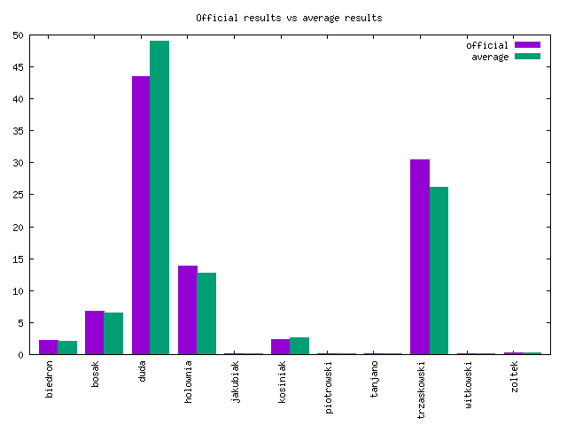
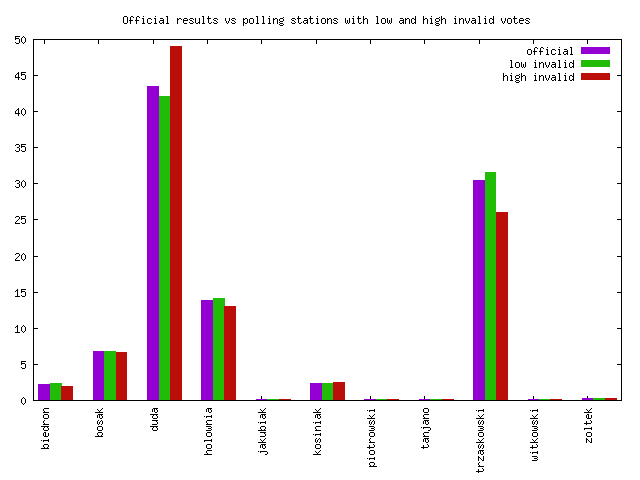
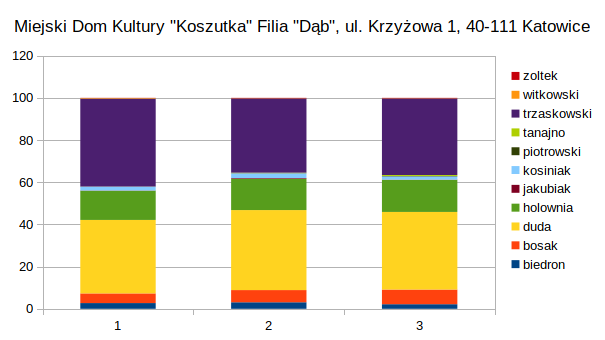
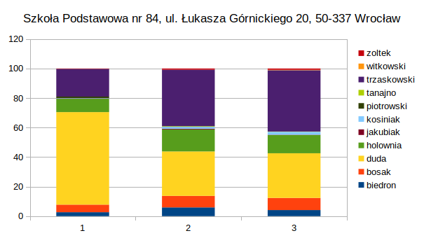

# Data and analysis about presidential election in Poland, 2020
* Aim of this repo is to give easier insight into presidential election in Poland, 2020.
* You have to be familiar with sql, gnuplot/r/javascript to play around with data, or you can use examples from repo.
* Please share, change, fork, comment, contribute... the more eyes, the more fair elections.
* I was inspired to do this by [https://dobek.org/2020/niepokojace-anomalia-statystyczne-w-wynikach-polonii/
](https://dobek.org/2020/niepokojace-anomalia-statystyczne-w-wynikach-polonii/
) and [https://www.wykop.pl/artykul/5582715/analiza-porownawcza-ilosci-glosow-niewaznych-vs-wyniki-wyborow-w-okregach-gt/
](https://www.wykop.pl/artykul/5582715/analiza-porownawcza-ilosci-glosow-niewaznych-vs-wyniki-wyborow-w-okregach-gt/
) - thank you guys!

**WARNING** - process of cleaning up whole repo is still in progress, so many paths doesn't work, just check for the input/output file paths

## Dependencies
Older versions could work also... or not.
* gnuplot 5.2
* sqlite 3.22
* node 12.14.1

## Preparation

Change dumped database into ```sqlite``` file:
```
cat db/data.sql | sqlite3 db/data.sqlite
```

Run npm install:
```
npm i
```

## Usage
Just play around with csv, ods or sqlite3 files. No GUI, sorry. Scripts are located in ```scripts``` dir and results in ```scripts/results``` dir.

Gnuplot example

```
gnuplot -p gnuplot/example_2_stats.plot
```

Node example:
```
node scripts-node/01-generate-chart.js --colX wynik_biedron_proc --colY glosy_niewazne_wiele_x_proc --show-chart
```

SQL example:
```
select symbol_kontrolny, karty_niewazne, siedziba
from runda1
where karty_niewazne > 3
order by karty_niewazne desc;
```

## Results

There is so many interesting things in such simple thing like presidential election, especially when political scene is so polarized.

For example:
* some candidates have official result above average from polling stations and some below:
    
* some have higher results form polling stations with high ratio of invalid votes, some lower
  
  * some polling stations from one building have very similar results
  
  and some don't
  

## Data
Data source:
* https://prezydent20200628.pkw.gov.pl/prezydent20200628/pl/dane_w_arkuszach (https://wybory.gov.pl/prezydent20200628/pl/dane_w_arkuszach)
* https://pkw.gov.pl/aktualnosci/informacje/protokol-pkw-o-wynikach-glosowania-w-wyborach-prezydenta-rzeczypospolitej-polskiej-przeprowadzonego-


Database ```db/data.sqlite3``` contains single table with all necessary data. The data should the exactly the same as data from ```data-round-X-converted/data.csv``` file. 

The only differences between the files are official data are:
* 7 rows were removed due to malformed spreadsheet formulas,
* columns with percentage results and invalid votes (suffix "proc") have been added,
* addresses of electoral commission were stripped of ',' (comma) character, because of how gnuplot works

## FAQ

* Why should we trust you? You shouldn't! Trust no one!

* Why analysis are so poor and not scientific? I'm not data scientist, I do what I can. You can do it better!

* Why not python, octave, cloud service, API, web app, D3.js? There are some ideas, but there is also so little time. If you have some spare time, you can do something about it!

* There is a mess in this repo, why? I don't know!

## License
Attribution-ShareAlike 4.0 International - CC BY-SA 4.0