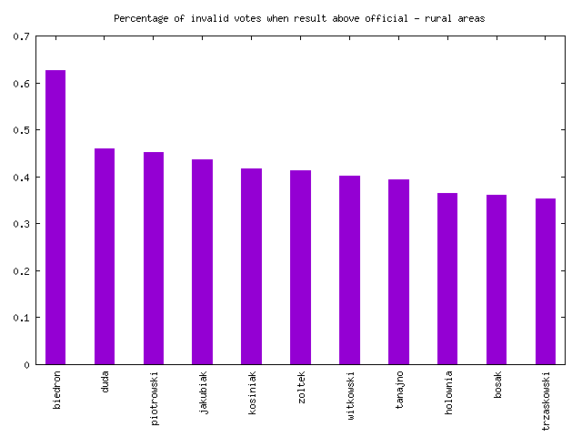
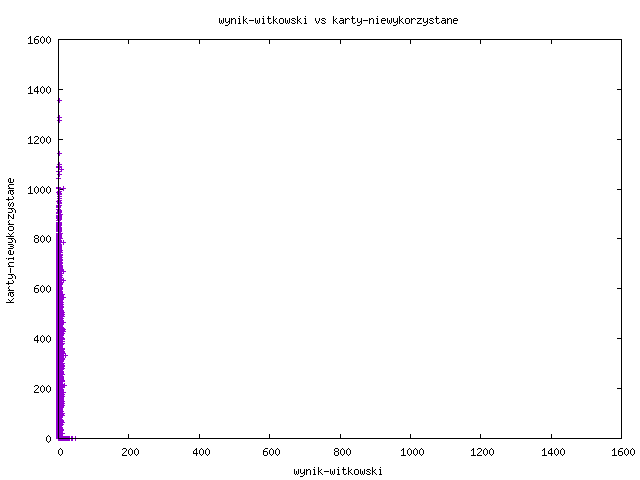
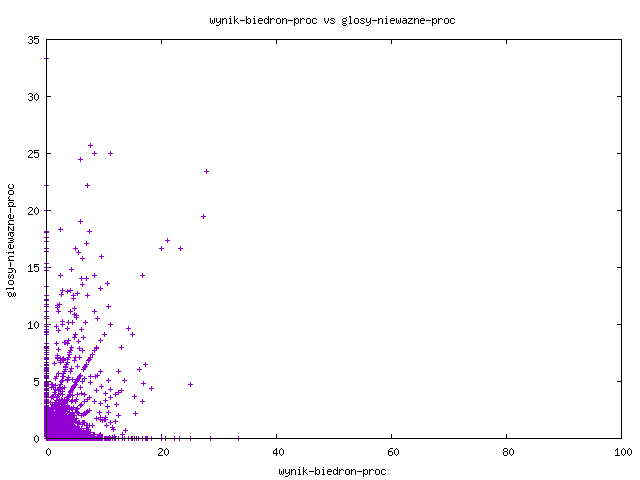

## Percentage of invalid votes when candidate had result above official, rural and urban areas - round 1

### SQL queries
```sql
select avg(glosy_niewazne_proc) from runda1 where typ_obszaru="wieś" and wynik_biedron_proc > 2.2245829788509;
select avg(glosy_niewazne_proc) from runda1 where typ_obszaru="wieś" and wynik_bosak_proc > 6.78136779580412;
select avg(glosy_niewazne_proc) from runda1 where typ_obszaru="wieś" and wynik_duda_proc > 43.5023228273371;
select avg(glosy_niewazne_proc) from runda1 where typ_obszaru="wieś" and wynik_holownia_proc > 13.8653193605736;
select avg(glosy_niewazne_proc) from runda1 where typ_obszaru="wieś" and wynik_jakubiak_proc > 0.173224922025876;
select avg(glosy_niewazne_proc) from runda1 where typ_obszaru="wieś" and wynik_kosiniak_proc > 2.36475776567495;
select avg(glosy_niewazne_proc) from runda1 where typ_obszaru="wieś" and wynik_piotrowski_proc > 0.108442538633394;
select avg(glosy_niewazne_proc) from runda1 where typ_obszaru="wieś" and wynik_tanajno_proc > 0.143675424197456;
select avg(glosy_niewazne_proc) from runda1 where typ_obszaru="wieś" and wynik_trzaskowski_proc > 30.4620110317439;
select avg(glosy_niewazne_proc) from runda1 where typ_obszaru="wieś" and wynik_witkowski_proc > 0.140488814588433;
select avg(glosy_niewazne_proc) from runda1 where typ_obszaru="wieś" and wynik_zoltek_proc > 0.233806540570276;


select avg(glosy_niewazne_proc) from runda1 where typ_obszaru="miasto" and wynik_biedron_proc > 2.2245829788509;
select avg(glosy_niewazne_proc) from runda1 where typ_obszaru="miasto" and wynik_bosak_proc > 6.78136779580412;
select avg(glosy_niewazne_proc) from runda1 where typ_obszaru="miasto" and wynik_duda_proc > 43.5023228273371;
select avg(glosy_niewazne_proc) from runda1 where typ_obszaru="miasto" and wynik_holownia_proc > 13.8653193605736;
select avg(glosy_niewazne_proc) from runda1 where typ_obszaru="miasto" and wynik_jakubiak_proc > 0.173224922025876;
select avg(glosy_niewazne_proc) from runda1 where typ_obszaru="miasto" and wynik_kosiniak_proc > 2.36475776567495;
select avg(glosy_niewazne_proc) from runda1 where typ_obszaru="miasto" and wynik_piotrowski_proc > 0.108442538633394;
select avg(glosy_niewazne_proc) from runda1 where typ_obszaru="miasto" and wynik_tanajno_proc > 0.143675424197456;
select avg(glosy_niewazne_proc) from runda1 where typ_obszaru="miasto" and wynik_trzaskowski_proc > 30.4620110317439;
select avg(glosy_niewazne_proc) from runda1 where typ_obszaru="miasto" and wynik_witkowski_proc > 0.140488814588433;
select avg(glosy_niewazne_proc) from runda1 where typ_obszaru="miasto" and wynik_zoltek_proc > 0.233806540570276;
```

### Result




### Discussion

Mr. Bierdon... shame on you! :)

Once again we could see two groups **Duda, Kosianiak, Piotrowski, Jakubiak** and **Bosak, Holownia, Trzaskowski, Witkowski, Tantajno**.

The better result of any of them **Duda, Kosianiak, Piotrowski, Jakubiak**, the more invalid votes.

The better result any of them **Bosak, Holownia, Trzaskowski, Witkowski, Tantajno**, the less invalid votes.

Differences between groups, once more are not big, but significant. If we assume that in some polling stations some ballot cards were manipulated deliberately, there could also occurs other anomalies.

## Official result vs results from polling stations with low and high invalid votes - round 1


### SQL queries
```sql
select avg(glosy_niewazne_proc) from runda1
```

```sql
select (100.0 * sum(wynik_biedron)/wazne) as biedron,
    (100.0 * sum(wynik_bosak)/wazne) as bosak,
    (100.0 * sum(wynik_duda)/wazne) as duda,
    (100.0 * sum(wynik_holownia)/wazne) as holownia,
    (100.0 * sum(wynik_jakubiak)/wazne) as jakubiak,
    (100.0 * sum(wynik_kosiniak)/wazne) as kosiniak,
    (100.0 * sum(wynik_piotrowski)/wazne) as piotrowski,
    (100.0 * sum(wynik_tanajno)/wazne) as tanajno,
    (100.0 * sum(wynik_trzaskowski)/wazne) as trzaskowski,
    (100.0 * sum(wynik_witkowski)/wazne) as witkowski,
    (100.0 * sum(wynik_zoltek)/wazne) as zoltek
from (select *
    from runda1
    where glosy_niewazne_proc <= 0.44011970855008),
    (select sum(glosy_wazne) as wazne
    from runda1
    where glosy_niewazne_proc <= 0.44011970855008);
```
And one more query with ">" instead of "<=".

### Results

|           |official|low invalid|low invalid, change|high invalid|high invalid, change|
|-----------|--------|-----------|------------------|------------|-------------------|
|biedron    |2.225   |2.293      |0.069             |1.964       |-0.260             |
|bosak      |6.781   |6.807      |0.025             |6.685       |-0.097             |
|duda       |43.502  |42.047     |-1.455            |49.018      |5.515              |
|holownia   |13.865  |14.083     |0.217             |13.041      |-0.824             |
|jakubiak   |0.173   |0.174      |0.001             |0.170       |-0.003             |
|kosiniak   |2.365   |2.318      |-0.047            |2.543       |0.178              |
|piotrowski |0.108   |0.108      |-0.001            |0.111       |0.002              |
|tanajno    |0.144   |0.143      |0.000             |0.145       |0.001              |
|trzaskowski|30.462  |31.644     |1.182             |25.980      |-4.482             |
|witkowski  |0.140   |0.146      |0.006             |0.119       |-0.022             |
|zoltek     |0.234   |0.236      |0.003             |0.224       |-0.009             |


### Discussion

We have two groups:
* for polling stations with low rate of invalid votes
    * **Biedroń, Bosak, Holownia, Jakubiak, Trzaskowski, Witkowski, Żółtek** had better results than official
    * **Duda, Kosiniak, Piotrowski** had worse results than official
* for polling stations with high rate of invalid votes
    * **Duda, Kosiniak, Piotrowski, Tanajno** had better results than official
    * **Biedroń, Bosak, Holownia, Jakubiak, Trzaskowski, Witkowski, Żółtek** had wore results than official

What is the reason of this? Hard to say. Probably there is some corelation between invalid votes and rural areas where Duda and Piotrowski had many voters.

Invalid votes rate for rural areas where Trzaskowski and Holownia had good result should be checked.

But once more we could see **Duda, Kosiniak, Piotrowski** in one group and **Biedroń, Bosak, Holownia, Trzaskowski, Witkowski** in another. Interesting!

One more thing, **Duda, Kosiniak, Piotrowski** have better result in polling stations with high ratio of invalid votes and polling stations with no invalid votes. At the same context **Biedroń, Bosak, Holownia, Trzaskowski, Witkowski** have worse result. Something very interesting is happening here, or I made some mistake somewhere.


## Official result vs results from polling stations with all votes and ballots valid - round 1

### SQL queries
```sql
select (100.0 * sum(wynik_biedron)/wazne) as biedron,
    (100.0 * sum(wynik_bosak)/wazne) as bosak,
    (100.0 * sum(wynik_duda)/wazne) as duda,
    (100.0 * sum(wynik_holownia)/wazne) as holownia,
    (100.0 * sum(wynik_jakubiak)/wazne) as jakubiak,
    (100.0 * sum(wynik_kosiniak)/wazne) as kosiniak,
    (100.0 * sum(wynik_piotrowski)/wazne) as piotrowski,
    (100.0 * sum(wynik_tanajno)/wazne) as tanajno,
    (100.0 * sum(wynik_trzaskowski)/wazne) as trzaskowski,
    (100.0 * sum(wynik_witkowski)/wazne) as witkowski,
    (100.0 * sum(wynik_zoltek)/wazne) as zoltek
from (select *
    from runda1
    where glosy_niewazne = 0 and karty_niewazne = 0 ),
    (select sum(glosy_wazne) as wazne
    from runda1
    where glosy_niewazne = 0 and karty_niewazne = 0);
```

```sql
select (100.0 * sum(wynik_biedron)/wazne) as biedron,
    (100.0 * sum(wynik_bosak)/wazne) as bosak,
    (100.0 * sum(wynik_duda)/wazne) as duda,
    (100.0 * sum(wynik_holownia)/wazne) as holownia,
    (100.0 * sum(wynik_jakubiak)/wazne) as jakubiak,
    (100.0 * sum(wynik_kosiniak)/wazne) as kosiniak,
    (100.0 * sum(wynik_piotrowski)/wazne) as piotrowski,
    (100.0 * sum(wynik_tanajno)/wazne) as tanajno,
    (100.0 * sum(wynik_trzaskowski)/wazne) as trzaskowski,
    (100.0 * sum(wynik_witkowski)/wazne) as witkowski,
    (100.0 * sum(wynik_zoltek)/wazne) as zoltek
from runda1,
    (select sum(glosy_wazne) as wazne
    from runda1);
```

### Result

| ------    | biedron | bosak | duda  | holownia | jakubiak | kosiniak | piotrowski | tanajno | trzaskowski | witkowski | zoltek |
|-----------|---------|-------|-------|----------|----------|----------|------------|---------|-------------|-----------|--------|
| official  | 2.22    | 6.78  | 43.50 | 13.87    | 0.17     | 2.36     | 0.11       | 0.14    | 30.46       | 0.14      | 0.23   |
| all valid | 2.02    | 6.75  | 47.26 | 13.30    | 0.17     | 2.57     | 0.11       | 0.14    | 27.32       | 0.12      | 0.22   |


### Discussion

If we take votes only from polling stations with all votes valid, then **Duda, Kosiniak, Piotrowski** whould have higher resutls than official.
On the other hand **Biedron, Bosak, Holownia, Trzaskowski, Witkowski, Żółtek** would have lower results, if we took votes only from polling stations without single invalid vote or ballot.

And again we have similar situation, for some reason **Duda, Kosiniak, Piotrowski** are in one group, and **Biedron, Bosak, Holownia, Trzaskowski, Witkowski** in another.

Maybe if something looks too good to be true (no invalid votes or ballots) it's not true?
Maybe it's somehow related to Abranham Wald work in Statistical Research Group (SRG) during WWII ([link](https://medium.com/@penguinpress/an-excerpt-from-how-not-to-be-wrong-by-jordan-ellenberg-664e708cfc3d
))? I don't know!

## Official result vs average result in polling stations - round 1

### SQL queries
Official:
```sql
select (100.0 * sum(wynik_biedron)/wazne) as biedron,
    (100.0 * sum(wynik_bosak)/wazne) as bosak,
    (100.0 * sum(wynik_duda)/wazne) as duda,
    (100.0 * sum(wynik_holownia)/wazne) as holownia,
    (100.0 * sum(wynik_jakubiak)/wazne) as jakubiak,
    (100.0 * sum(wynik_kosiniak)/wazne) as kosiniak,
    (100.0 * sum(wynik_piotrowski)/wazne) as piotrowski,
    (100.0 * sum(wynik_tanajno)/wazne) as tanajno,
    (100.0 * sum(wynik_trzaskowski)/wazne) as trzaskowski,
    (100.0 * sum(wynik_witkowski)/wazne) as witkowski,
    (100.0 * sum(wynik_zoltek)/wazne) as zoltek
from runda1,
    (select sum(glosy_wazne) as wazne
    from runda1);
```
Average:
```sql
select avg(wynik_biedron_proc) as biedron,
    avg(wynik_bosak_proc) as bosak,
    avg(wynik_duda_proc) as duda,
    avg(wynik_holownia_proc) as holownia,
    avg(wynik_jakubiak_proc) as jakubiak,
    avg(wynik_kosiniak_proc) as kosiniak,
    avg(wynik_piotrowski_proc) as piotrowski,
    avg(wynik_tanajno_proc) as tanajno,
    avg(wynik_trzaskowski_proc) as trzaskowski,
    avg(wynik_witkowski_proc) as witkowski,
    avg(wynik_zoltek_proc) as zoltek
from runda1;
```

### Result

|          | biedron | bosak | duda  | holownia | jakubiak | kosiniak | piotrowski | tanajno | trzaskowski | witkowski | zoltek |
|----------|---------|-------|-------|----------|----------|----------|------------|---------|-------------|-----------|--------|
| official | 2.22    | 6.78  | 43.50 | 13.87    | 0.17     | 2.36     | 0.11       | 0.14    | 30.46       | 0.14      | 0.23   |
| avgerage | 2.03    | 6.51  | 48.99 | 12.81    | 0.20     | 2.60     | 0.13       | 0.15    | 26.19       | 0.13      | 0.24   |


### Discussion

Why **Duda, Jakubiak, Kosiniak, Piotrowski, Tanajno, Żółtek** have higher average than official result?

Why **Biedron, Bosak, Holownia, Trzaskowski, Witkowski** have higher official than average?

I don't know.

Why average results could be meaningful, anyway? I don't know.


## Invalid ballots - round 1

### SQL query
```sql
select symbol_kontrolny, karty_niewazne, siedziba
from runda1
where karty_niewazne > 3
order by karty_niewazne desc;
```


### Result

```
71,"Zespół Szkół Salezjańskich w Poznaniu, os. Bohaterów II Wojny Światowej 29, 61-387 Poznań"
44,"Londyn III, Ambasada RP w Londynie 47 Portland Place London, W1B 1JH, Londyn, Zjednoczone Królestwo Wielkiej Brytanii i Irlandii Północnej"
43,"Londyn II, Ambasada RP w Londynie 47 Portland Place London, W1B 1JH, Londyn, Zjednoczone Królestwo Wielkiej Brytanii i Irlandii Północnej"
43,"Londyn IV, Wydział Konsularny Ambasady RP w Londynie 10 Bouverie Street London, EC4Y 8AX, Londyn, Zjednoczone Królestwo Wielkiej Brytanii i Irlandii Północnej"
40,"Szkoła Podstawowa nr 64 im. Marii Konopnickiej, os. Orła Białego 120, 61-251 Poznań"
39,"LIX Liceum Ogólnokształcące Mistrzostwa Sportowego, S. B. Lindego 20, 01-952 Warszawa"
39,"Poland House 90 Gloucester Place London W1U 6HS, Londyn, Zjednoczone Królestwo Wielkiej Brytanii i Irlandii Północnej"
27,"Liceum Ogólnokształcące, ul. Podwale 16, 68-200 Żary"
27,"Rokietnicki Ośrodek Sportu, ul. Szamotulska 29, 62-090 Rokietnica"
25,"Budynek Ochotniczej Straży Pożarnej, ul. Krakusa 14, 44-321 Marklowice"
24,"XXXIV Liceum Ogólnokształcące im. Krzysztofa Kieślowskiego, ul. Wapienna 17, 91-078 Łódź"
23,"Budynek starej Szkoły Podstawowej w Chorowicach, Chorowice ul. Doboszyńskiego 48, 32-031 Mogilany"
23,"Szkoła Podstawowa Nr 8, ul. Janasa 11, 42-612 Tarnowskie Góry"
22,"Biblioteka Miejska w Łodzi Filia nr 73, ul. Piękna 35/39, 93-558 Łódź"
22,"Londyn V, Wydział Konsularny Ambasady RP w Londynie 10 Bouverie Street London, EC4Y 8AX, Londyn, Zjednoczone Królestwo Wielkiej Brytanii i Irlandii Północnej"
21,"AAI-Polska AIKIDO, ul. Immanuela Kanta 15A, 10-691 Olsztyn"
20,"Urząd Gminy w Suchożebrach, Aleksandry Ogińskiej 11, 08-125 Suchożebry"
20,"Szkoła Podstawowa im. Henryka Sienkiewicza, ul. Polna 40, 05-082 Stare Babice"
19,"Świetlica Wiejska w Goraju, Goraj 24, 66-340 Przytoczna"
19,"Manchester II, Konsulat Generalny RP, 51 Portland Street, Manchester, M1 3LD, Manchester, Zjednoczone Królestwo Wielkiej Brytanii i Irlandii Północnej"
18,"Gminny Ośrodek Kultury w Pomiechówku, Jana Kilińskiego 1, 05-180 Pomiechówek"
18,"Republika Irlandii, Dublin, Wydział Konsularny Ambasady RP w Dublinie 4 - 8 Eden Quay Dublin 1, D01 N5W8, Dublin, Irlandia"
17,"Szkoła Podstawowa Nr 5, ul. Chramcówki 27, 34-500 Zakopane"
17,"Monachium I, Konsulat Generalny RP Röntgenstrasse 5 81679 München, Monachium, Republika Federalna Niemiec"
15,"Szkoła Podstawowa Nr 1, ul. Idzikowskiego 2a, 05-070 Sulejówek"
15,"Szkoła Podstawowa Nr 70 z Oddziałami Integracyjnymi im. Bohaterów Monte Cassino, ul. G. Bruna 11, 02-594 Warszawa"
15,"Moniecki Ośrodek Kultury w Mońkach, ul. Białostocka 25, 19-100 Mońki"
14,"Kolonia II, Konsulat Generalny RP Im Media Park 5 C 50670 Köln, Kolonia, Republika Federalna Niemiec"
14,"Zespół Szkolno-Przedszkolny Nr 2 - Publiczna Szkoła Podstawowa Nr 16, ul. Zofii Nałkowskiej 16, 45-558 Opole"
13,"Szkoła Podstawowa w Wilkołazie Pierwszym, Wilkołaz Pierwszy 7, 23-212 Wilkołaz"
13,"Monachium II, Konsulat Generalny RP Röntgenstrasse 5 81679 München, Monachium, Republika Federalna Niemiec"
13,"Kino Morena, ul. Przybrzeżna 1, 73-140 Ińsko"
```
More data here [sql-queries/01-invalid-ballots.csv](sql-queries/01-invalid-ballots.csv)
### Discussion

Because everyone is able to put into ballot box whatever he want... I think co conclusion could be made about this aspect. Maybe analysis about how many ballots were given to people and how many were pulled out from the box could answer some questions here.

## Difference between votes from envelopes put in ballot box and pulled out  - round 1

### SQL query:
```
SELECT symbol_kontrolny, koperty_wrzucone_do_urny, karty_z_kopert, karty_z_kopert - koperty_wrzucone_do_urny as roznica_glosy_z_kopert, siedziba FROM runda1 where koperty_wrzucone_do_urny <> karty_z_kopert order by (koperty_wrzucone_do_urny - karty_z_kopert) DESC
```

### Results
```
-125    Haga II, Ambasada RP (dawny WPHI) Van Lennepweg 51 2597 LG Den Haag, Haga, Królestwo Niderlandów
-92 Londyn V, Wydział Konsularny Ambasady RP w Londynie 10 Bouverie Street London, EC4Y 8AX, Londyn, Zjednoczone Królestwo Wielkiej Brytanii i Irlandii Północnej
-38 Nowy Jork II, Konsulat Generalny RP 233 Madison Avenue (Jan Karski Corner) New York, NY 10016, Nowy Jork, Stany Zjednoczone Ameryki
-28 Zespół Szkół Odzieżowych Nr 1, ul. Cechowa 57, 30-614 Kraków
-20 Republika Irlandii, Dublin, Wydział Konsularny Ambasady RP w Dublinie 4 - 8 Eden Quay Dublin 1, D01 N5W8, Dublin, Irlandia
-16 Szkoła Podstawowa Nr 124, ul. Weigla 2, 30-898 Kraków
-7  Przedszkole nr 267, ul. Witolda Małcużyńskiego 4, 02-793 Warszawa
-5  Republika Irlandii, Dublin, Rezydencja Ambasadora RP 12 Ailesbury Road, Ballsbridge Dublin 4, D04 C659, Dublin, Irlandia
-5  Berlin I, Ambasada RP Lassenstraße 19 – 21 14193 Berlin, Berlin, Republika Federalna Niemiec
-5  Berlin III, Ambasada RP Lassenstraße 19 – 21 14193 Berlin, Berlin, Republika Federalna Niemiec
-5  Dom Kultury w Szówsku, Szówsko ul. Sportowa 5, 37-522 Wiązownica
-4  Los Angeles, Konsulat Generalny RP 12400 Wilshire Blvd, Suite 555 Los Angeles, CA 90025, Los Angeles, Stany Zjednoczone Ameryki
-4  Belfast, Konsulat Generalny RP 67 Malone Road Belfast, BT9 6SB, Belfast, Zjednoczone Królestwo Wielkiej Brytanii i Irlandii Północnej
-4  Poland House 90 Gloucester Place London W1U 6HS, Londyn, Zjednoczone Królestwo Wielkiej Brytanii i Irlandii Północnej
-3  Hamburg III, Konsulat Generalny RP Gründgensstraße 20 22309 Hamburg, Hamburg, Republika Federalna Niemiec
-3  Berlin IV, Ambasada RP Lassenstraße 19 – 21 14193 Berlin, Berlin, Republika Federalna Niemiec
-3  Szkoła Podstawowa Nr 2, ul. Misiągiewicza 10, 37-200 Przeworsk
-3  Zespół Szkolno-Przedszkolny Nr 4, ul. Powstańców Warszawskich 42, 42-680 Tarnowskie Góry
-2  Szkoła Podstawowa Nr 4 w Myślenicach, ul. Zdrojowa 14, 32-400 Myślenice
-2  Szkoła Podstawowa nr 323, ul. Ludwika Hirszfelda 11, 02-776 Warszawa
-2  Bruksela, Wydział Konsularny Ambasady RP Rue des Francs 28 1040 Bruxelles, Bruksela, Królestwo Belgii
-2  Kopenhaga, Ambasada RP Richelieus Allé 12 2900 Hellerup, Kopenhaga, Królestwo Danii
-2  Kanada, Vancouver, Konsulat Generalny RP 1177 West Hastings Street, Suite 1600, Vancouver, BC V6E 2K3, Vancouver, Kanada
-2  Szkoła Podstawowa im. Św. Jana Kantego w Grzegorzówce, Grzegorzówka 173, 36-025 Dylągówka
-2  Biuro Nadleśnictwa, ul. Kopytko 13, 43-300 Bielsko-Biała
-2  Miejski Dom Kultury Filia Nr 2, Świnoujście, Warszów Sosnowa 18, 72-602 Świnoujście
-1  Liceum Ogólnokształcące nr VII, ul. Krucza 49, 53-410 Wrocław
-1  Liceum Ogólnokształcące nr XIII, ul. gen. Józefa Haukego-Bosaka 33 - 37, 50-447 Wrocław
-1  Szkoła Podstawowa nr 33, ul. Kolista 17, 54-152 Wrocław
-1  Szkoła Podstawowa nr 44, ul. Wilanowska 31, 51-206 Wrocław
-1  Ośrodek Pomocy Społecznej w Skwierzynie, ul. Stefana Batorego 15, 66-440 Skwierzyna
-1  Miejski Ośrodek Sportu i Rekreacji Hala Akrobatyczna, ul. Urszuli 22, 65-147 Zielona Góra
-1  Samorządowe Przedszkole w Sulejowie, ul. Konecka 29, 97-330 Sulejów
-1  Oświęcimskie Centrum Kultury, ul. Jędrzeja Śniadeckiego 24, 32-600 Oświęcim
-1  XIII Liceum Ogólnokształcące, ul. Sądowa 4, 31-542 Kraków
-1  Zespół Szkolno-Przedszkolny Nr 7, ul. Skotnicka 86, 30-394 Kraków
-1  Zespół Szkolno-Przedszkolny Nr 5, os. Oświecenia 30, 31-636 Kraków
-1  Państwowa Wyższa Szkoła Zawodowa, ul. Chruślicka 6, 33-300 Nowy Sącz
-1  Publiczna Szkoła Podstawowa Nr 1 w Kozienicach, ul. Tadeusza Kościuszki 1, 26-900 Kozienice
-1  Szkoła Podstawowa Nr 1, ul. Ostrowska 58, 07-320 Małkinia Górna
-1  Samorządowe Przedszkole w Jabłonnie Lackiej, ul. Kubusia Puchatka 1, 08-304 Jabłonna Lacka
-1  S. B. M. "WARDOM", J. Kochanowskiego 49, 01-864 Warszawa
-1  Klub WSBM "Chomiczówka", P. Nerudy 1, 01-926 Warszawa
-1  Praga, Wydział Konsularny Ambasady RP Truhlářská 13 - 15 110 00 Praha 1, Praga, Republika Czeska
-1  Kolonia II, Konsulat Generalny RP Im Media Park 5 C 50670 Köln, Kolonia, Republika Federalna Niemiec
-1  Kolonia III, Konsulat Generalny RP Im Media Park 5 C 50670 Köln, Kolonia, Republika Federalna Niemiec
-1  Oslo I, Ambasada RP Olav Kyrres plass 1 0244 Oslo, Oslo, Królestwo Norwegii
-1  Chicago II, Konsulat Generalny RP 1530 N Lake Shore Drive Chicago, IL 60610, Chicago, Stany Zjednoczone Ameryki
-1  Publiczna Szkoła Podstawowa w Pilźnie, ul. Adama Mickiewicza 1, 39-220 Pilzno
-1  Zespół Szkolno-Przedszkolny, Siemianice ul. Słupska 42, 76-200 Słupsk
-1  Przedsiębiorstwo Wodociągów i Kanalizacji, ul. Witomińska 29, 81-311 Gdynia
-1  Zespół Szkolno-Przedszkolny nr 4, ul. Chwaszczyńska 26, 81-571 Gdynia
-1  Szkoła Podstawowa nr 2 im. Tadeusza Kościuszki, ul. Henryka Pobożnego 2, 76-200 Słupsk
-1  Szkoła Podstawowa Nr 7, ul. Ławczana 12, 43-600 Jaworzno
-1  Szkoła Podstawowa nr 36, ul. Iłłakowiczówny 13, 40-134 Katowice
-1  Świetlica wiejska, Łęgno 18, 11-040 Dobre Miasto
-1  Szkoła Podstawowa Nr 3 im. Powstańców Wielkopolskich, ul. Jana Kochanowskiego 1, 64-800 Chodzież
-1  Szkoła Podstawowa im. Jana Pawła II w Mroczeniu, Szkoła Filialna w Grębaninie, Grębanin 87, 63-604 Baranów
-1  Zespół Szkół i Placówek Oświatowych w Lubiniu, Lubiń ul. Powstańców 23, 64-010 Krzywiń
-1  Gminny Ośrodek Kultury, ul. Sienkiewicza 3, 63-020 Zaniemyśl
-1  Szkoła Podstawowa Nr 5 im. Polskich Noblistów w Śremie, ul. Dezyderego Chłapowskiego 12A, 63-100 Śrem
-1  Liceum Ogólnokształcące Mistrzostwa Sportowego im. Poznańskich Olimpijczyków, os. Tysiąclecia 43, 61-255 Poznań
-1  Szkoła Podstawowa Nr 35, ul. Świętoborzyców 40 (Hala Sportowa), 71-665 Szczecin
1   Zespół Szkół Ponadpodstawowych im. Tadeusza Kościuszki w Kamieńsku (sala gimnastyczna), ul. Szkolna 4, 97-360 Kamieńsk
1   Zespół Szkół Ogólnokształcących Nr 18, ul. Senatorska 35, 30-106 Kraków
1   Szkoła Podstawowa Nr 4, Grodzisk Mazowiecki, Łąki ul. Zielony Rynek 2, 05-825 Grodzisk Mazowiecki
1   Szkoła Podstawowa Nr 321, ul. ppłk W. Szadkowskiego 3, 01-493 Warszawa
1   LXVIII Liceum Ogólnokształcące im. Tytusa Chałubińskiego, ul. L. Narbutta 65/71, 02-524 Warszawa
1   Szkoła Podstawowa nr 215, ul. Kwatery Głównej 13, 04-330 Warszawa
1   Sydney, Konsulat Generalny RP 10 Trelawney St. Woollahra, 2025 NSW, Sydney, Związek Australijski
1   Kolonia V, Konsulat Generalny RP Im Media Park 5 C 50670 Köln, Kolonia, Republika Federalna Niemiec
1   Uniwersytet Rzeszowski, al. Rejtana 16c, 35-310 Rzeszów
1   Szkoła Podstawowa Nr 45, ul. Łagodna 10, 15-757 Białystok
1   Urząd Gminy (Sala Posiedzeń), ul. Lipowska 730, 43-374 Buczkowice
1   Publiczna Szkoła Podstawowa Nr 9, ul. Niewiadoma 19, 27-400 Ostrowiec Świętokrzyski
1   Szkoła Podstawowa nr 2 w Kórniku, ul. Armii Krajowej 11, 62-035 Kórnik
1   Szkoła Podstawowa nr 25 z Oddziałami Integracyjnymi i Specjalnymi, ul. Ignacego Prądzyńskiego 53, 61-527 Poznań
2   Szkoła Podstawowa Nr 53, ul. Skośna 8, 30-383 Kraków
2   Szkoła Podstawowa Nr 103, os. Kolorowe 29, 31-941 Kraków
2   Integracyjne Centrum Dydaktyczno-Sportowe, ul. Staszica 2, 05-092 Łomianki
2   Szkoła Podstawowa im. Jana Pawła II w Łopusznie, ul. Strażacka 5, 26-070 Łopuszno
2   Szkoła Podstawowa w Kuźni, Kuźnia 36, 63-313 Chocz
3   Budynek Ochotniczej Straży Pożarnej, ul. Krakusa 14, 44-321 Marklowice
3   Szkoła Podstawowa Nr 2 im. „Ewarysta Estkowskiego”, ul. Wrocławska 51, 63-400 Ostrów Wielkopolski
7   Londyn III, Ambasada RP w Londynie 47 Portland Place London, W1B 1JH, Londyn, Zjednoczone Królestwo Wielkiej Brytanii i Irlandii Północnej
8   Zespół Szkół Zawodowych Huty im. T. Sendzimira, os. Złotej Jesieni 2, 31-826 Kraków
17  Londyn I, Ambasada RP w Londynie 47 Portland Place London, W1B 1JH, Londyn, Zjednoczone Królestwo Wielkiej Brytanii i Irlandii Północnej
```

### Discussion

Why more ballots were pulled out from ballot box in Londyn I, Ambasada RP w Londynie 47 Portland Place London than it was put in? I don't know!

Why 125 votes were missing in Haga II, Ambasada RP (dawny WPHI) Van Lennepweg 51? I don't know!

Why 87 polling stations had problems with with putting in and pulling out the same amount of votes from envelopes? Maybe some envelopes "with" votes were empty? Maybe some envelopes had more votes than one? Indeed, interesting! Even fascinating.


## Candidate result as a function of unused ballot papers - round 1

### Code used to generate charts
```
    node scripts-node/generate_chart.js --colY karty_niewykorzystane --colX wynik_biedron 
    node scripts-node/generate_chart.js --colY karty_niewykorzystane --colX wynik_bosak
    node scripts-node/generate_chart.js --colY karty_niewykorzystane --colX wynik_duda
    node scripts-node/generate_chart.js --colY karty_niewykorzystane --colX wynik_holownia
    node scripts-node/generate_chart.js --colY karty_niewykorzystane --colX wynik_jakubiak
    node scripts-node/generate_chart.js --colY karty_niewykorzystane --colX wynik_kosiniak
    node scripts-node/generate_chart.js --colY karty_niewykorzystane --colX wynik_piotrowski
    node scripts-node/generate_chart.js --colY karty_niewykorzystane --colX wynik_tanajno
    node scripts-node/generate_chart.js --colY karty_niewykorzystane --colX wynik_trzaskowski
    node scripts-node/generate_chart.js --colY karty_niewykorzystane --colX wynik_witkowski
    node scripts-node/generate_chart.js --colY karty_niewykorzystane --colX wynik_zoltek
```

### Results





In order to set the same maximum for both axis, not all data points were placed on chart.

### Discussion
Why Duda's chart is significantly different than Trzaskowski's? I don't know.


## Candidate result as a function of invalid votes - round 1

### Code used to generate charts
```
node scripts-node/generate_chart.js --colY glosy_niewazne_proc --colX wynik_biedron_proc 
node scripts-node/generate_chart.js --colY glosy_niewazne_proc --colX wynik_bosak_proc
node scripts-node/generate_chart.js --colY glosy_niewazne_proc --colX wynik_duda_proc
node scripts-node/generate_chart.js --colY glosy_niewazne_proc --colX wynik_holownia_proc
node scripts-node/generate_chart.js --colY glosy_niewazne_proc --colX wynik_jakubiak_proc
node scripts-node/generate_chart.js --colY glosy_niewazne_proc --colX wynik_kosiniak_proc
node scripts-node/generate_chart.js --colY glosy_niewazne_proc --colX wynik_piotrowski_proc
node scripts-node/generate_chart.js --colY glosy_niewazne_proc --colX wynik_tanajno_proc
node scripts-node/generate_chart.js --colY glosy_niewazne_proc --colX wynik_trzaskowski_proc
node scripts-node/generate_chart.js --colY glosy_niewazne_proc --colX wynik_witkowski_proc
node scripts-node/generate_chart.js --colY glosy_niewazne_proc --colX wynik_zoltek_proc
```

### Results





### Discussion
Why Duda's chart is significantly different than Trzaskowski's and all other candidates? I don't know.
Is seems that when Duda had high result in some district electoral commission, it was somehow correlated with high ratio of invalid votes.


