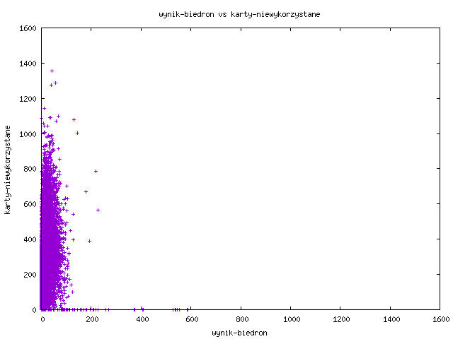
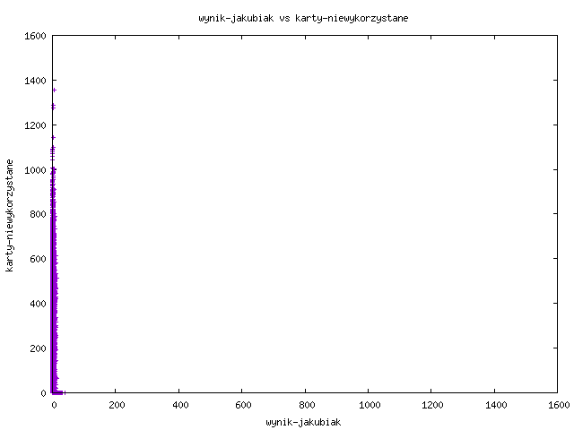
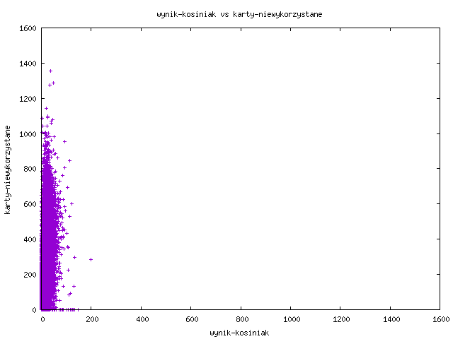

## Invalid ballots

### SQL query
```sql
select symbol_kontrolny, karty_niewazne, siedziba
from runda1
where karty_niewazne > 3
order by karty_niewazne desc;
```


### Result

|symbol_kontrolny                       |karty_niewazne|siedziba                                                                                                                                                      |
|---------------------------------------|--------------|--------------------------------------------------------------------------------------------------------------------------------------------------------------|
|95a6-2adb-67f7-1648-78b1-959d-cb59-3803|71            |Zespół Szkół Salezjańskich w Poznaniu, os. Bohaterów II Wojny Światowej 29, 61-387 Poznań                                                                     |
|4061-42c3-e043-ce96-4e12-3507-e9f3-c46a|44            |Londyn III, Ambasada RP w Londynie 47 Portland Place London, W1B 1JH, Londyn, Zjednoczone Królestwo Wielkiej Brytanii i Irlandii Północnej                    |
|5d81-5587-9470-22a6-9e48-fdd9-a4e9-6096|43            |Londyn II, Ambasada RP w Londynie 47 Portland Place London, W1B 1JH, Londyn, Zjednoczone Królestwo Wielkiej Brytanii i Irlandii Północnej                     |
|fdda-3fe2-a28e-19ec-4522-0076-b929-8d98|43            |Londyn IV, Wydział Konsularny Ambasady RP w Londynie 10 Bouverie Street London, EC4Y 8AX, Londyn, Zjednoczone Królestwo Wielkiej Brytanii i Irlandii Północnej|
|6773-221f-7294-dedb-4a39-f320-648f-b7a0|40            |Szkoła Podstawowa nr 64 im. Marii Konopnickiej, os. Orła Białego 120, 61-251 Poznań                                                                           |
|013c-2292-7b60-09ec-36e4-e059-d04e-654b|39            |LIX Liceum Ogólnokształcące Mistrzostwa Sportowego, S. B. Lindego 20, 01-952 Warszawa                                                                         |
|428e-482c-985a-8c5c-c767-1468-dddb-482e|39            |Poland House 90 Gloucester Place London W1U 6HS, Londyn, Zjednoczone Królestwo Wielkiej Brytanii i Irlandii Północnej                                         |
|05ce-3681-062f-4e87-7132-1703-b26c-989a|27            |Liceum Ogólnokształcące, ul. Podwale 16, 68-200 Żary                                                                                                          |
|aab2-ea7c-a5a8-6d60-a6e8-f4b5-a9c8-e689|27            |Rokietnicki Ośrodek Sportu, ul. Szamotulska 29, 62-090 Rokietnica                                                                                             |
|657c-3676-72f5-0555-5a26-b3ed-6d45-0653|25            |Budynek Ochotniczej Straży Pożarnej, ul. Krakusa 14, 44-321 Marklowice                                                                                        |
|4d9d-ab43-6957-4be3-c555-919c-b19d-72bc|24            |XXXIV Liceum Ogólnokształcące im. Krzysztofa Kieślowskiego, ul. Wapienna 17, 91-078 Łódź                                                                      |
|f6e8-4725-1ee4-d47b-d2bd-5b85-02c6-a460|23            |Budynek starej Szkoły Podstawowej w Chorowicach, Chorowice ul. Doboszyńskiego 48, 32-031 Mogilany                                                             |
|15fd-c3c6-c2a0-f7eb-fed7-8f45-71c7-5545|23            |Szkoła Podstawowa Nr 8, ul. Janasa 11, 42-612 Tarnowskie Góry                                                                                                 |
|301b-d634-f23e-b951-5c55-9cd7-2ede-d904|22            |Biblioteka Miejska w Łodzi Filia nr 73, ul. Piękna 35/39, 93-558 Łódź                                                                                         |
|f118-698d-3b80-8f5e-08ad-6a7e-941d-6d33|22            |Londyn V, Wydział Konsularny Ambasady RP w Londynie 10 Bouverie Street London, EC4Y 8AX, Londyn, Zjednoczone Królestwo Wielkiej Brytanii i Irlandii Północnej |
|67b5-9607-3e22-8848-2bb2-f031-fdfa-f84a|21            |AAI-Polska AIKIDO, ul. Immanuela Kanta 15A, 10-691 Olsztyn                                                                                                    |
|2575-f061-2709-3c05-fce2-098d-bd71-7c1e|20            |Urząd Gminy w Suchożebrach, Aleksandry Ogińskiej 11, 08-125 Suchożebry                                                                                        |
|e1c9-aa11-9517-f450-fb72-16bb-352f-8359|20            |Szkoła Podstawowa im. Henryka Sienkiewicza, ul. Polna 40, 05-082 Stare Babice                                                                                 |
|a1bd-f8f2-93e1-73d7-0720-f567-7988-01da|19            |Świetlica Wiejska w Goraju, Goraj 24, 66-340 Przytoczna                                                                                                       |
|bb55-0eb4-fd65-34c4-71b4-14be-645f-018b|19            |Manchester II, Konsulat Generalny RP, 51 Portland Street, Manchester, M1 3LD, Manchester, Zjednoczone Królestwo Wielkiej Brytanii i Irlandii Północnej        |
|135e-9f45-0c66-130f-d00b-04be-bc87-b8a2|18            |Gminny Ośrodek Kultury w Pomiechówku, Jana Kilińskiego 1, 05-180 Pomiechówek                                                                                  |
|a9a0-5193-25a9-06f2-dd40-8577-2bcb-b376|18            |Republika Irlandii, Dublin, Wydział Konsularny Ambasady RP w Dublinie 4 - 8 Eden Quay Dublin 1, D01 N5W8, Dublin, Irlandia                                    |
|3ac7-cbfa-a08f-418b-2022-3113-66e9-2379|17            |Szkoła Podstawowa Nr 5, ul. Chramcówki 27, 34-500 Zakopane                                                                                                    |
|de28-353c-b90d-705d-1ea4-4049-b074-ed19|17            |Monachium I, Konsulat Generalny RP Röntgenstrasse 5 81679 München, Monachium, Republika Federalna Niemiec                                                     |
|e206-61d8-ea74-77b6-a5a7-fc63-dec5-8b03|15            |Szkoła Podstawowa Nr 1, ul. Idzikowskiego 2a, 05-070 Sulejówek                                                                                                |
|e82f-3cf2-0732-d9b9-0294-f4c8-f748-1c9f|15            |Szkoła Podstawowa Nr 70 z Oddziałami Integracyjnymi im. Bohaterów Monte Cassino, ul. G. Bruna 11, 02-594 Warszawa                                             |
|df53-32ae-f141-a7d8-43b9-c433-483d-c108|15            |Moniecki Ośrodek Kultury w Mońkach, ul. Białostocka 25, 19-100 Mońki                                                                                          |
|f36b-43cc-cc9d-6782-4408-98d1-8af7-68ba|14            |Kolonia II, Konsulat Generalny RP Im Media Park 5 C 50670 Köln, Kolonia, Republika Federalna Niemiec                                                          |
|3210-b050-c5f9-0b2a-1b52-519a-ed42-e775|14            |Zespół Szkolno-Przedszkolny Nr 2 - Publiczna Szkoła Podstawowa Nr 16, ul. Zofii Nałkowskiej 16, 45-558 Opole                                                  |
|f389-71af-b7fb-812f-b834-fd5b-6feb-6d6e|13            |Szkoła Podstawowa w Wilkołazie Pierwszym, Wilkołaz Pierwszy 7, 23-212 Wilkołaz                                                                                |
|c7d7-5e80-761f-0759-9efb-437a-b7bb-ee44|13            |Monachium II, Konsulat Generalny RP Röntgenstrasse 5 81679 München, Monachium, Republika Federalna Niemiec                                                    |
|20f2-4749-4b7e-2230-e666-1aa8-d42c-23d8|13            |Kino Morena, ul. Przybrzeżna 1, 73-140 Ińsko                                                                                                                  |
|46ed-e6ea-f674-60fb-a3db-7b19-dddf-8a85|12            |Szkoła Podstawowa nr 199 im. Juliana Tuwima, ul. Elsnera 8, 92-504 Łódź                                                                                       |
|2c56-8312-f2ba-0db7-41ec-16a1-0436-e174|12            |Szkoła Podstawowa Nr 380 im. Jana Pawła II, ul. Krasiczyńska 4/6, 03-379 Warszawa                                                                             |
|2415-a681-c68b-304a-df8c-3831-e1ec-a0c2|12            |Szkoła Podstawowa w Rudzie, Ruda 124, 39-315 Ruda                                                                                                             |
|6a77-3c17-08fb-f96c-b42b-e4c8-8bdb-41fd|12            |Szkoła Podstawowa Nr 1, ul. Wyzwolenia 160, 44-321 Marklowice                                                                                                 |
|903e-5b1f-bf6b-d267-17d9-153b-1d46-42e0|12            |Zespół Szkolno-Przedszkolny nr 2, ul. Łozowa 77, 61-448 Poznań                                                                                                |
|eef4-a059-85b5-a287-b806-cd7e-97ce-fe6a|11            |Szkoła Podstawowa nr 56 im. Bronisława Czecha, ul. Turoszowska 10, 91-025 Łódź                                                                                |
|8b5a-b9f2-af80-da45-df2b-a406-2151-b755|11            |Szkoła Podstawowa nr 137 im. Aleksandra Kamińskiego, ul. Olimpijska 9, 94-043 Łódź                                                                            |
|9b96-6ce7-9f64-dd00-903e-f036-391b-6412|11            |Zespół Szkolno Przedszkolny w Duczkach, Duczki ul. Szosa Jadowska 37, 05-200 Wołomin                                                                          |
|6b0d-e51c-210b-5283-2a79-27aa-8fff-b573|11            |Londyn I, Ambasada RP w Londynie 47 Portland Place London, W1B 1JH, Londyn, Zjednoczone Królestwo Wielkiej Brytanii i Irlandii Północnej                      |
|2b24-9338-4898-5bf7-d552-1bcf-c71e-1517|11            |Szkoła Podstawowa Nr 1, ul. Wyzwolenia 160, 44-321 Marklowice                                                                                                 |
|78f4-07f5-cd8d-e03a-c793-4877-e98d-a430|11            |Zespół Szkół w Ińsku, ul. Poprzeczna 1, 73-140 Ińsko                                                                                                          |
|1d95-1db5-b0c6-bad1-5afa-be6f-ac26-3a5f|10            |Przedszkole nr 7, ul. Ks. Kanonika Jana Hryniewicza 7, 21-040 Świdnik                                                                                         |
|d56a-a846-9e31-cedf-ce07-49a5-48b2-2dbd|10            |Zespół Szkół nr 21, ul. Saska 78, 04-044 Warszawa                                                                                                             |
|15fa-26c2-d3b2-475b-ee8e-3e44-6f03-3bca|10            |Manchester I, Konsulat Generalny RP, 51 Portland Street, Manchester, M1 3LD, Manchester, Zjednoczone Królestwo Wielkiej Brytanii i Irlandii Północnej         |
|be18-509a-f0b0-a332-94ab-9947-fb21-047b|10            |XXI Liceum Ogólnokształcące z Oddziałami Sportowymi, Gdańsk ul. Kołobrzeska 77, 80-396 Gdańsk 53                                                              |
|7a98-05c3-a81e-671a-0bf4-f23a-dd71-4b5a|10            |Szkoła Podstawowa nr 13, ul. Aleja Józefa Piłsudskiego 24, 41-303 Dąbrowa Górnicza                                                                            |
|6866-975a-1289-ede5-314f-0f65-d191-962b|10            |Szkoła Podstawowa Nr 2 (sala nr 18), ul. Adama Mickiewicza 8, 11-300 Biskupiec                                                                                |
|a192-5739-1dcb-5225-1501-403b-c3e6-530e|9             |Szkoła Podstawowa, Toporzysko 166, 34-240 Jordanów                                                                                                            |
|be0a-c35c-7246-e729-ef0a-3658-f613-7623|9             |Szkoła Podstawowa Nr 2 im. Orła Białego w Chotomowie, Chotomów Partyzantów 23, 05-123 CHOTOMÓW                                                                |
|502f-4448-b730-ae44-51d4-b289-0f92-1a5b|9             |Przedszkole nr 160, ul. Niepołomicka 26, 04-243 Warszawa                                                                                                      |
|23a6-2159-728d-049a-11d5-1e67-ac03-101b|9             |Szkoła Podstawowa nr 139, ul. Syreny 5/7, 01-132 Warszawa                                                                                                     |
|0583-cb8a-6f0a-7964-cc55-c80f-539e-6a33|9             |STOWARZYSZENIE SZKOŁY GEDANENSIS, Gdańsk ul. Dworska 34, 80-506 Gdańsk 26                                                                                     |
|8a5f-11cd-752f-f56f-5816-dcf0-ab7e-5552|9             |Państwowa Szkoła Muzyczna I stopnia, ul. Inwalidów Wojennych 2a, 43-600 Jaworzno                                                                              |
|8db7-22fb-a4e5-4848-f1e0-397b-a73a-aa92|8             |Miejskie Przedszkole Nr 18, ul. Staffa 6, 59-220 Legnica                                                                                                      |
|1b1a-eee4-67d3-e5d8-4af7-9d03-b7ee-8959|8             |XIV Liceum Ogólnokształcące, ul. Chełmońskiego 24, 31-322 Kraków                                                                                              |
|8499-e6b5-1973-b9a3-511c-4564-a6fb-c06c|8             |Szkoła Podstawowa Nr 4, ul. 1 Maja 19, 05-200 Wołomin                                                                                                         |
|eda9-597f-3026-e94c-5009-bd88-d1d1-2b9a|8             |Szkoła Podstawowa Nr 364, ul. M. E. Andriollego 1, 01-494 Warszawa                                                                                            |
|aa78-c7fe-301c-b797-5098-ccd5-4db5-2b75|8             |Filia Szkoły Podstawowej Nr 342, ul. Topolowa 15, 03-138 Warszawa                                                                                             |
|e693-8fcf-4e91-72ba-b6b6-413e-fb82-f155|8             |Szkoła Podstawowa Nr 103 im. Bohaterów Warszawy 1939 - 1945, ul. Jeziorna 5/9, 02-911 Warszawa                                                                |
|c207-14f9-f2d2-d806-a25f-d14c-8850-ecd5|8             |Zespół Szkół Nr 79, Wiertnicza 26, 02-952 Warszawa                                                                                                            |
|b699-62b0-0dd1-3e0f-06ed-6c18-5358-b4d3|8             |Chicago III, Konsulat Generalny RP 1530 N Lake Shore Drive Chicago, IL 60610, Chicago, Stany Zjednoczone Ameryki                                              |
|c1fa-443b-6d0b-2822-5b81-26eb-448e-5c0e|8             |Edynburg I, Konsulat Generalny RP 2 Kinnear Road Edinburgh, EH3 5PE, Edynburg, Zjednoczone Królestwo Wielkiej Brytanii i Irlandii Północnej                   |
|7ef0-74d4-21e1-1850-523e-1854-dd78-5dc8|8             |Zespół Szkół Ogólnokształcących Nr 2, ul. Słoneczna 2, 82-500 Kwidzyn                                                                                         |
|0501-3c85-e61b-dde9-41a1-081b-cc04-6872|8             |Szkoła Podstawowa Nr 8, al. Jana Pawła II 10, 83-200 Starogard Gdański                                                                                        |
|2678-5e47-1d45-bb83-fb8b-9887-8857-7c5b|8             |Szkoła Podstawowa Nr 1, Gdańsk ul. Gojawiczyńskiej 10, 80-286 Gdańsk 44                                                                                       |
|e225-e7c1-d7d0-4722-d14a-5b7f-8411-83b8|8             |Szkoła Podstawowa Nr 2, Marklowice, Marklowice-Chałupki ul. Wiosny Ludów 78, 44-321                                                                           |
|8400-dadb-1299-e807-ce53-e497-22d2-7f97|8             |Szkoła Podstawowa Nr 8, ul. Pawła Cymsa 14, 62-200 Gniezno                                                                                                    |
|8fcf-8114-a272-c243-085d-0ad2-c4fd-bdd8|7             |Szkoła Podstawowa, Sitaniec 422, 22-400 Zamość                                                                                                                |
|ae02-b044-a283-b225-00c3-5b51-2c05-3bcb|7             |III Liceum Ogólnokształcące w Zamościu, ul. Jana Kilińskiego 15, 22-400 Zamość                                                                                |
|674f-9c11-37ef-854d-02af-59a9-1916-498f|7             |Szkoła Podstawowa nr 12, ul. Dobra 16, 66-400 Gorzów Wielkopolski                                                                                             |
|bacc-7ff1-02a5-a976-b673-4910-28ce-3e08|7             |Szkoła Podstawowa Nr 114, ul. Łąkowa 31, 31-443 Kraków                                                                                                        |
|f5d2-6b03-6c86-2e21-5a68-9c0d-0193-2b92|7             |Szkoła Podstawowa Nr 21, ul. Batalionu „Skała” AK 12, 31-273 Kraków                                                                                           |
|e0ca-58a0-5f22-5a85-a399-3a4d-ba21-0d3a|7             |Zespół Szkolno-Przedszkolny Nr 5, os. Oświecenia 30, 31-636 Kraków                                                                                            |
|b4c0-ef0c-3768-18e0-8c5c-c67b-441a-413a|7             |Zespół Szkolno-Przedszkolny Nr 1, ul. Gościniec 53, 05-077 Warszawa                                                                                           |
|ca34-e1e1-2269-ef97-19b5-bc49-6190-c39b|7             |Przedszkole Nr 376, Admiralska 17, 00-910 Warszawa                                                                                                            |
|007a-b56e-df6b-e715-c36e-af33-327d-a3ab|7             |Przedszkole nr 267, ul. Witolda Małcużyńskiego 4, 02-793 Warszawa                                                                                             |
|607b-a098-37a5-93fd-fc30-c677-911e-ef81|7             |XXVI Liceum Ogólnokształcące, ul. Alpejska 16, 04-628 Warszawa                                                                                                |
|806d-376d-3c7d-2731-609c-0455-be4c-9256|7             |Belfast, Konsulat Generalny RP 67 Malone Road Belfast, BT9 6SB, Belfast, Zjednoczone Królestwo Wielkiej Brytanii i Irlandii Północnej                         |
|3652-7e35-3fa9-fbe3-4011-a16f-90ea-e686|7             |Dom Kultury w Wysokiej, Wysoka 81, 37-100 Łańcut                                                                                                              |
|e000-1e3f-8f5a-a730-256b-b3fb-8bfe-fce3|7             |XIX Liceum Ogólnokształcące, Gdańsk ul. Pestalozziego 11/13, 80-445 Gdańsk 6                                                                                  |
|ac8d-67df-11bf-c9bc-6f19-e0ee-b420-33bb|7             |Szkoła Podstawowa Nr 37 im. gen. Mariusza Zaruskiego, ul. Doliny Miętusiej 5, 43-300 Bielsko-Biała                                                            |
|2bb2-4515-ba6d-6637-66fd-08be-149b-2cad|7             |Miejski Ośrodek Pomocy Rodzinie w Poznaniu Filia Jeżyce, ul. Jana Długosza 18a, 60-558 Poznań                                                                 |
|c71e-c5e4-3be5-6002-69df-9549-8a9f-8fe7|7             |Szkoła Podstawowa nr 1, ul. Hezjoda 15, 60-461 Poznań                                                                                                         |
|4d0e-3583-a750-8b3d-9c2c-2913-c3ed-3b68|6             |Przedsiębiorstwo Wodociągów i Kanalizacji, Aleja Wojska Polskiego 6/1a, 59-700 Bolesławiec                                                                    |
|5788-0515-5ebc-512f-3a1e-b471-81b2-a275|6             |Świetlica Wiejska, Mrozów ul. Wyzwolenia 24, 55-330 Miękinia                                                                                                  |
|8b2f-6bb3-589b-bb4e-195a-fef3-f93d-77b7|6             |Zespół Szkolno-Przedszkolny w Smolcu, Smolec ul. Kościelna 2, 55-080 Kąty Wrocławskie                                                                         |
|482d-6f09-c33d-1ec5-6817-fe2e-7be4-ff3a|6             |Zespół Szkolno-Przedszkolny nr 17, ul. Wieczysta 105, 50-550 Wrocław                                                                                          |
|3e02-fb17-9aa2-b71c-f91e-94fe-d4a7-fa25|6             |Zespół Szkół nr 20, ul. Kłodnicka 36, 54-218 Wrocław                                                                                                          |
|7f90-ca54-e75e-c848-4ab4-8509-25bb-e476|6             |Szkoła Podstawowa Nr 8, ul. Łyskowskiego 28, 87-100 Toruń                                                                                                     |
|67ce-996f-62c6-7d24-0ed1-03df-7b67-e738|6             |Zespół Szkolno-Przedszkolny nr 4 Przedszkole nr 20, ul. Gen. Władysława Sikorskiego 6A, 97-200 Tomaszów Mazowiecki                                            |
|af78-7f4e-d2b6-efbc-547b-e7e6-7646-ec8f|6             |XXXIV Liceum Ogólnokształcące im. Krzysztofa Kieślowskiego, ul. Wapienna 17, 91-087 Łódź                                                                      |
|f858-4a36-7523-5aac-e08f-fce9-08bf-8d5b|6             |Zespół Szkół Nr 5, ul. Mackiewicza 15, 31-214 Kraków                                                                                                          |
|345b-2b37-1305-274f-6f0a-0be7-c580-5259|6             |Zespół Szkolno-Przedszkolny Nr 5, os. Oświecenia 30, 31-636 Kraków                                                                                            |
|7dee-5770-38fb-9e69-abc9-3b2b-fbff-80bd|6             |Przedszkole Nr 2 im. Pyzy Wędrowniczki, ul. Polna 32, 05-200 Wołomin                                                                                          |
|9037-9c5f-eef0-f2a2-eb60-9fc9-d63e-b7ef|6             |Szkoła Podstawowa Nr 377 im. mjr. Henryka Dobrzańskiego "Hubala", ul. Trocka 4, 03-563 Warszawa                                                               |
|fc9a-b89a-ac54-7995-af06-5055-8931-b051|6             |Zakład Remontów i Konserwacji Dróg, ul. Kompanii Kordian 44, 02-495 Warszawa                                                                                  |
|e449-9cf5-643f-4e61-b801-b310-6ef9-d5ba|6             |Paryż II, Ambasada RP w Paryżu 57, rue Saint Dominique 75007 Paris, Paryż, Republika Francuska                                                                |
|21c5-a7ef-4be9-e7fa-4ca1-5942-d88b-6666|6             |Oslo II, Ambasada RP Olav Kyrres plass 1 0244 Oslo, Oslo, Królestwo Norwegii                                                                                  |
|c43a-a466-0d34-9aa3-b5e7-6c9d-1361-ba95|6             |Szkoła Podstawowa Nr 12, Gdańsk ul. Człuchowska 6, 80-180 Gdańsk 42                                                                                           |
|192f-5a72-092d-e71d-56c0-2717-b0b6-f2ab|6             |Miejsko-Gminny Ośrodek Kultury, ul. Poznańska 33, 62-025 Kostrzyn                                                                                             |
|5c70-bb64-6ee7-704d-9835-7019-abe4-9add|6             |Szkoła Podstawowa Nr 51, ul. Mikołajczyka 20, 71-075 Szczecin                                                                                                 |
|7d45-d1c0-ce21-2f19-63e0-4c8d-10ed-6151|5             |Szkoła Podstawowa z Oddziałami Integracyjnymi nr 6 im. Janusza Korczaka w Oleśnicy, ul. gen. Franciszka Kleeberga 4, 56-400 Oleśnica                          |
|d41e-0399-3bc8-53ff-eb11-9f2d-7ddb-7d4b|5             |Szkoła Podstawowa Nr 10, ul. Morcinka 31, 58-500 Jelenia Góra                                                                                                 |
|0cf2-0c54-604c-f2c6-99fb-019e-fbc3-923c|5             |Rada Osiedla Biskupin-Sępolno-Dąbie-Bartoszowice, ul. Fryderyka Pautscha 4, 51-651 Wrocław                                                                    |
|4bc8-f790-9627-361a-9908-6e25-61e4-5cf4|5             |Zespół Szkół Nr 11, Papieżka 89, 87-800 Włocławek                                                                                                             |
|45d8-ff1b-ccd9-1bd2-71d2-3e20-4f04-2a9d|5             |Szkoła Podstawowa, Lokal Nr 1, Gołąb Puławska 32, 24-100 Puławy                                                                                               |
|d378-e8b5-f49c-a91e-ccd8-2638-8ad8-e53c|5             |Zielonogórska Spółdzielnia Mieszkaniowa Administracja Osiedla Łużyckie, ul. Krośnieńska 17c, 65-625 Zielona Góra                                              |
|b47f-7c4f-ebc4-d138-d991-5a40-381e-bcb1|5             |Zespół Szkół Specjalnych Nr 1, ul. Piastowska 9, 65-515 Zielona Góra                                                                                          |
|4dc9-28d3-2cfb-a9fb-8009-b3f3-8378-2705|5             |Zespół Szkół Specjalnych Nr 1, ul. Piastowska 9, 65-515 Zielona Góra                                                                                          |
|f292-5243-618f-704f-c343-6f38-5679-6956|5             |Szkoła Podstawowa nr 8, ul. Kąpielowa 7, 65-383 Zielona Góra                                                                                                  |
|895b-417a-01cc-dcc1-a681-2ae7-aa7b-83d8|5             |Szkoła Podstawowa nr 169 im. Marii Dąbrowskiej, ul. Napoleońska 7/17, 94-231 Łódź                                                                             |
|420e-c33c-ed3d-0877-0137-9fb5-76c2-3682|5             |Szkoła Podstawowa Nr 95, ul. Wileńska 9b, 31-413 Kraków                                                                                                       |
|361c-f650-f3d0-e5ec-4e14-fd2a-c1a9-5e55|5             |Szkoła Podstawowa im. Bł. Celiny Borzęckiej, ul. Malborska 98, 30-624 Kraków                                                                                  |
|95cf-62b8-b3f3-4536-9994-7317-a594-20bf|5             |Oddział Szkoły Podstawowej nr 5, ul. Sikorskiego 20, 05-500 Piaseczno                                                                                         |
|8859-772c-c27f-61e9-176f-42bd-af18-d1c4|5             |Miejskie Przedszkole Nr 13, ul. Antka 7, 05-800 Pruszków                                                                                                      |
|d35f-8bc4-ed89-ba70-818a-7464-34ba-6af2|5             |Szkoła Podstawowa nr 319, ul. Wokalna 1, 02-787 Warszawa                                                                                                      |
|7790-92c2-8e92-5243-e556-0fe8-4a32-f23e|5             |Gminny Ośrodek Kultury w Czeremsze, ul. 1 - go Maja 77, 17-240 Czeremcha                                                                                      |
|4f10-13ac-8bbd-f644-6a9f-fb39-69c4-d456|5             |Gminny Ośrodek Kultury w Krypnie, Krypno Wielkie 9, 19-111 Krypno Kościelne                                                                                   |
|1471-735d-2e45-a49f-5237-5d61-2506-9644|5             |Szkoła Podstawowa nr 1, ul. Zblewska 18, 83-200 Starogard Gdański                                                                                             |
|e28e-3652-5ede-6f02-d7a8-7ba5-e930-ff20|5             |XXI Liceum Ogólnokształcące z Oddziałami Sportowymi, Gdańsk ul. Kołobrzeska 75, 80-396 Gdańsk 53                                                              |
|f36e-373f-564d-7b95-6e9d-666f-3fa6-8ad9|5             |Zespół Szkolno-Przedszkolny w Wojkowicach Kościelnych, ul. Zachodnia 4, 42-510 Wojkowice Kościelne                                                            |
|668f-e1d3-a97d-8631-fc1b-f0dc-c797-40f8|5             |Szkoła Podstawowa nr 35 im. Ks. Franciszka Blachnickiego, ul. Śląska 18A, 44-206 Rybnik                                                                       |
|7d87-a265-45f4-43aa-5110-3688-ee60-de9a|5             |Urząd Miasta, ul. Strycharska 6, 25-361 Kielce                                                                                                                |
|eacf-d1cd-57de-eede-83dc-fcbe-7580-58d9|5             |Miejsko-Gminny Ośrodek Kultury, Sądowa 23, 13-230 Lidzbark                                                                                                    |
|7257-4670-9d09-18d3-23ef-1fbc-3f56-3264|5             |Szkoła Podstawowa we Wrzesinie (hol na parterze), Wrzesina 43, 11-042 Jonkowo                                                                                 |
|47ee-2e94-96ac-1b0b-954f-08f8-f566-557c|5             |Przedszkole nr 134 „Słoneczny Świat”, os. Kosmonautów 108, 61-642 Poznań                                                                                      |
|ac69-7e74-d578-cc21-cd89-8ff6-4e90-0acb|5             |Zespół Szkół w Stargardzie, ul. Popiela 2, 73-110 Stargard                                                                                                    |
|07b4-58eb-ea85-d881-f28b-d320-3715-75d5|4             |Cech Rzemiosł Różnych oraz Małej i Średniej Przedsiębiorczości w Oleśnicy, ul. Wrocławska 41 - 43, 56-400 Oleśnica                                            |
|d4a6-4c6d-ce4c-7cdb-dd43-55a8-ffe6-1266|4             |Szkoła Podstawowa w Kiełczowie, ul. Szkolna 3, 55-093 Kiełczów                                                                                                |
|e798-131a-b384-64ef-686a-bbc8-ca2a-d53e|4             |Szkoła Podstawowa nr 61, ul. Skarbowców 8, 53-025 Wrocław                                                                                                     |
|785b-2997-e443-ff01-3723-9fa0-30ff-2690|4             |Zespół Szkolno-Przedszkolny, ul. Stasia i Nel 2, 21-400 Łuków                                                                                                 |
|bd27-e442-f1ca-4240-5394-cc03-779f-c866|4             |Miejska Biblioteka Publiczna w Brzezinach, ul. św. Anny 36, 95-060 Brzeziny                                                                                   |
|040b-c85e-a3dc-366c-af37-bd37-646a-fecd|4             |Szkoła Podstawowa Nr 1, ul. św. Marka 34, 31-024 Kraków                                                                                                       |
|268c-d8f0-16f0-a7df-3e44-df04-afa6-23de|4             |Zespół Szkolno-Przedszkolny Nr 11, ul. Aleksandry 17, 30-837 Kraków                                                                                           |
|441e-dc4d-d2f5-4ca0-5763-055d-8a5f-bf16|4             |Szkoła Podstawowa im. Armii Krajowej, Jabłonna Szkolna 2, 05-110 JABŁONNA                                                                                     |
|ba87-358c-4673-bd94-b86c-962e-ac5a-5d5f|4             |Zespół Placówek Oświatowych Nr 3 Miejskie Przedszkole Samorządowe, ul. Hoża 6, 06-500 Mława                                                                   |
|5a43-f054-8874-6c10-8d0f-bc28-cc6e-4e12|4             |Zespół Szkół, ul. Karola Namysłowskiego 11, 05-820 Piastów                                                                                                    |
|d71a-8d12-a13c-2806-20fc-d122-3689-b9cb|4             |Zespół Szkół Zawodowych im. Jana Ruszkowskiego, Aleja Tysiąclecia 12, 06-100 Pułtusk                                                                          |
|9323-6e96-305a-bd02-346b-3d38-ed5e-53bb|4             |Przedszkole /modułowe/ w Ożarowie Mazowieckim, ul. Szkolna 3, 05-850 Ożarów Mazowiecki                                                                        |
|1d7b-5eb9-09e5-918b-aa54-84a6-647f-2a10|4             |TBS, ul. gen. T. Pełczyńskiego 30, 01-471 Warszawa                                                                                                            |
|2abc-1b0e-e9a1-40c2-03f1-06ce-8b56-6233|4             |Budynek Świetlicy na Skwerze Sportów Miejskich, ul. Gen. Tadeusza Pełczyńskiego 22H, 01-471 Warszawa                                                          |
|9143-b703-feec-a34d-f7df-c7e4-da58-5721|4             |Szkoła Podstawowa nr 263, Szegedyńska 11, 01-957 Warszawa                                                                                                     |
|452c-180d-4ff2-d056-ef4f-d300-e342-4741|4             |Przedszkole Nr 284, ul. Jałtańska 8, 02-760 Warszawa                                                                                                          |
|aa1c-112d-8efd-f668-d6d8-9012-5e4e-4d41|4             |Szkoła Podstawowa nr 72, ul. L. M. Paca 44, 04-395 Warszawa                                                                                                   |
|72c3-6793-dc26-f41d-509a-e598-ed79-85c3|4             |LXVII Liceum Ogólnokształcące, ul. Hoża 11/15, 00-528 Warszawa                                                                                                |
|74be-75c3-ac01-6cb3-ff6a-5ad7-0f69-3aa8|4             |Szkoła Podstawowa Nr 84 im. Waleriana Łukasińskiego, ul. Radzymińska 227, 03-611 Warszawa                                                                     |
|899a-dced-bb4d-1a9c-0150-70ea-9271-19f4|4             |Prywatna Szkoła Podstawowa Nr 6, ul. Jerzego Zaruby 2, 02-796 Warszawa                                                                                        |
|7cc3-05b2-c268-4cce-6ec0-6393-1bd8-c2fc|4             |Szkoła Podstawowa nr 100, ul. Taneczna 54/58, 02-829 Warszawa                                                                                                 |
|101c-5fe6-db37-7d0e-70c0-53fb-0fde-91bf|4             |Młodzieżowy Ośrodek Socjoterapii „Dom na Trakcie”, ul. Trakt Lubelski 40, 04-870 Warszawa                                                                     |
|33b7-dff9-ef6c-091e-0210-e9ce-fa53-0cd0|4             |Szkoła Podstawowa nr 238, ul. Redutowa 37, 01-106 Warszawa                                                                                                    |
|d062-2443-ecf2-ada9-7810-5152-07e2-2dcb|4             |Berlin I, Ambasada RP Lassenstraße 19 – 21 14193 Berlin, Berlin, Republika Federalna Niemiec                                                                  |
|9b5d-bbad-0b06-04a6-3e71-24f4-161f-0289|4             |Kolonia I, Konsulat Generalny RP Im Media Park 5 C 50670 Köln, Kolonia, Republika Federalna Niemiec                                                           |
|c9f4-c240-7cc0-8596-bf25-1324-194f-8957|4             |Chicago I, Konsulat Generalny RP 1530 N Lake Shore Drive Chicago, IL 60610, Chicago, Stany Zjednoczone Ameryki                                                |
|953d-cc67-32ec-3fd6-037e-3ed3-2ac6-6ef5|4             |Kolonia IV, Konsulat Generalny RP Im Media Park 5 C 50670 Köln, Kolonia, Republika Federalna Niemiec                                                          |
|4b11-a2ad-281f-b4c9-9ab9-d397-0648-7cb1|4             |Szkoła Podstawowa Nr 2 w Humniskach, Humniska 877, 36-206 Humniska                                                                                            |
|b511-2b42-33b1-070b-12ca-1b06-6ce8-2a80|4             |Przedszkole Nr 3, al. Wojska Polskiego 8b, 83-200 Starogard Gdański                                                                                           |
|d56c-3031-4ce7-a533-3c73-f8bd-c084-9483|4             |Szkoła Podstawowa nr 6, ul. Gniewowska 33, 84-240 Reda                                                                                                        |
|d0d9-f479-3da3-382e-0bff-ae71-c39d-7ea8|4             |Szkoła Podstawowa nr 1 (część sali gimnastycznej-wejście B), ul. Szkolna 13, 84-242 Luzino                                                                    |
|e6bc-a8ee-e36c-47be-4226-ebda-b296-2cf0|4             |Szkoła Podstawowa Nr 29, Gdańsk ul. Miałki Szlak 74, 80-717 Gdańsk 50                                                                                         |
|f96a-93bf-d457-ee42-2e5a-5435-9fd5-c7c1|4             |Przedszkole nr 44, ul. Tatarczana 4, 81-591 Gdynia                                                                                                            |
|4946-615f-5853-d378-549c-3275-f9de-d7a1|4             |Szkoła Podstawowa nr 39, ul. adm. J. Unruga 88, 81-181 Gdynia                                                                                                 |
|a53c-78e8-2ce8-d488-7f7c-0f14-1180-4bbd|4             |Przychodnia Rejonowa, ul. 11 Listopada 7, 76-200 Słupsk                                                                                                       |
|6f6c-9766-75a4-d033-cf46-d71e-0e66-f85d|4             |Szkoła Podstawowa Nr 5, ul. Leśna 23, 42-600 Tarnowskie Góry                                                                                                  |
|00b5-ec89-288b-4790-56cf-fa5a-631c-2ec4|4             |Szkoła Podstawowa Specjalna Nr 40, ul. Orląt Lwowskich 12b, 41-902 Bytom                                                                                      |
|c40e-8f50-2d2f-f01d-e644-2f74-8300-9d42|4             |Szkoła Podstawowa dla Dziewcząt PŁOMIEŃ, ul. Karliczka 15, 40-488 Katowice                                                                                    |
|46a7-7c16-91e1-dd18-b227-ed21-48d1-8683|4             |Przedszkole Samorządowe nr 32, ul. Jana Kasprowicza 5, 25-411 Kielce                                                                                          |
|a839-ba5e-f6c3-952b-43fa-bdd5-cd93-24c2|4             |Szkoła Podstawowa nr 6 im. Hipolita Cegielskiego z Oddziałami Integracyjnymi, os. Rusa 56, 61-245 Poznań                                                      |
|af86-5e48-b083-ae3d-0fea-214e-2aa2-7bda|4             |Szkoła Podstawowa nr 59 im. gen. J. H. Dąbrowskiego, ul. Baranowska 1, 61-353 Poznań                                                                          |
|1db6-03b6-6a02-66d7-5a7d-70f8-4759-c083|4             |Szkoła Podstawowa nr 90 im. hr. Władysława Zamoyskiego, ul. Józefa Chociszewskiego 56, 60-261 Poznań                                                          |
|0a70-803c-b4af-9778-6326-2ea6-fd65-ae7b|4             |Zespół Szkolno-Przedszkolny nr 11, os. Bolesława Chrobrego 105, 60-681 Poznań                                                                                 |
|1ad3-39ef-914d-5b28-b50e-8fb3-84bc-9920|4             |Szkoła Podstawowa Nr 10, ul. Fryderyka Chopina 42, 75-567 Koszalin                                                                                            |
|3048-13dd-bd5c-dacd-0849-86e1-183d-7371|4             |Publiczna Szkoła Podstawowa „Na Głębokiem”, ul. Jaworowa 41, 71-382 Szczecin                                                                                  |
### Discussion

No discussion here - I don't even know what to ask about it.

## Difference between votes from envelopes put in ballot box and pulled out 

### SQL query:
```
SELECT symbol_kontrolny, koperty_wrzucone_do_urny, karty_z_kopert, karty_z_kopert - koperty_wrzucone_do_urny as roznica_glosy_z_kopert, siedziba FROM runda1 where koperty_wrzucone_do_urny <> karty_z_kopert order by (koperty_wrzucone_do_urny - karty_z_kopert) DESC
```

### Results

|symbol_kontrolny                       |koperty_wrzucone_do_urny|karty_z_kopert|roznica_glosy_z_kopert|siedziba                                                                                                                                                     |
|---------------------------------------|------------------------|--------------|----------------------|-------------------------------------------------------------------------------------------------------------------------------------------------------------|
|e0a8-a495-e114-917f-331f-35f5-eb4c-c490|7072                    |6947          |-125                  |Haga II, Ambasada RP (dawny WPHI) Van Lennepweg 51 2597 LG Den Haag, Haga, Królestwo Niderlandów                                                             |
|f118-698d-3b80-8f5e-08ad-6a7e-941d-6d33|10945                   |10853         |-92                   |Londyn V, Wydział Konsularny Ambasady RP w Londynie 10 Bouverie Street London, EC4Y 8AX, Londyn, Zjednoczone Królestwo Wielkiej Brytanii i Irlandii Północnej|
|2159-21d1-3547-451a-74bd-afd4-5ed0-5934|3497                    |3459          |-38                   |Nowy Jork II, Konsulat Generalny RP 233 Madison Avenue (Jan Karski Corner) New York, NY 10016, Nowy Jork, Stany Zjednoczone Ameryki                          |
|dd44-f3ff-b6ef-eb76-cfe4-1d77-1d3e-5cb4|28                      |0             |-28                   |Zespół Szkół Odzieżowych Nr 1, ul. Cechowa 57, 30-614 Kraków                                                                                                 |
|a9a0-5193-25a9-06f2-dd40-8577-2bcb-b376|6352                    |6332          |-20                   |Republika Irlandii, Dublin, Wydział Konsularny Ambasady RP w Dublinie 4 - 8 Eden Quay Dublin 1, D01 N5W8, Dublin, Irlandia                                   |
|dd3e-3358-6e50-7d6d-3889-e307-8ee6-9fdc|24                      |8             |-16                   |Szkoła Podstawowa Nr 124, ul. Weigla 2, 30-898 Kraków                                                                                                        |
|007a-b56e-df6b-e715-c36e-af33-327d-a3ab|21                      |14            |-7                    |Przedszkole nr 267, ul. Witolda Małcużyńskiego 4, 02-793 Warszawa                                                                                            |
|0564-0c8c-b26a-b68f-8213-1292-a77b-8540|6535                    |6530          |-5                    |Republika Irlandii, Dublin, Rezydencja Ambasadora RP 12 Ailesbury Road, Ballsbridge Dublin 4, D04 C659, Dublin, Irlandia                                     |
|d062-2443-ecf2-ada9-7810-5152-07e2-2dcb|2112                    |2107          |-5                    |Berlin I, Ambasada RP Lassenstraße 19 – 21 14193 Berlin, Berlin, Republika Federalna Niemiec                                                                 |
|21cb-fb3e-2b1d-f953-c1b6-1c9a-5445-4f3a|2251                    |2246          |-5                    |Berlin III, Ambasada RP Lassenstraße 19 – 21 14193 Berlin, Berlin, Republika Federalna Niemiec                                                               |
|2413-9af3-16e7-2bcf-b8ec-558c-1f33-d163|16                      |11            |-5                    |Dom Kultury w Szówsku, Szówsko ul. Sportowa 5, 37-522 Wiązownica                                                                                             |
|a9a2-3ea0-cc8e-316c-0b46-ff76-ae3e-101e|2811                    |2807          |-4                    |Los Angeles, Konsulat Generalny RP 12400 Wilshire Blvd, Suite 555 Los Angeles, CA 90025, Los Angeles, Stany Zjednoczone Ameryki                              |
|806d-376d-3c7d-2731-609c-0455-be4c-9256|5202                    |5198          |-4                    |Belfast, Konsulat Generalny RP 67 Malone Road Belfast, BT9 6SB, Belfast, Zjednoczone Królestwo Wielkiej Brytanii i Irlandii Północnej                        |
|428e-482c-985a-8c5c-c767-1468-dddb-482e|11333                   |11329         |-4                    |Poland House 90 Gloucester Place London W1U 6HS, Londyn, Zjednoczone Królestwo Wielkiej Brytanii i Irlandii Północnej                                        |
|40a9-9938-3066-209f-bc3c-769a-0af8-9ad3|3126                    |3123          |-3                    |Hamburg III, Konsulat Generalny RP Gründgensstraße 20 22309 Hamburg, Hamburg, Republika Federalna Niemiec                                                    |
|4b09-95cf-d5b5-34e4-df20-f4d3-0163-a2fa|2350                    |2347          |-3                    |Berlin IV, Ambasada RP Lassenstraße 19 – 21 14193 Berlin, Berlin, Republika Federalna Niemiec                                                                |
|d915-bc69-cb21-b63a-396d-be88-cceb-ddd4|7                       |4             |-3                    |Szkoła Podstawowa Nr 2, ul. Misiągiewicza 10, 37-200 Przeworsk                                                                                               |
|c638-dc27-4d2a-9743-399d-5c69-c7ce-7b9f|12                      |9             |-3                    |Zespół Szkolno-Przedszkolny Nr 4, ul. Powstańców Warszawskich 42, 42-680 Tarnowskie Góry                                                                     |
|0cd1-1837-2f18-fa0c-f0e0-93c0-666d-dbd3|9                       |7             |-2                    |Szkoła Podstawowa Nr 4 w Myślenicach, ul. Zdrojowa 14, 32-400 Myślenice                                                                                      |
|d79e-aaa2-e10e-f313-eed8-3116-c9e7-a01b|24                      |22            |-2                    |Szkoła Podstawowa nr 323, ul. Ludwika Hirszfelda 11, 02-776 Warszawa                                                                                         |
|3950-11e9-916e-8560-60a9-bb8f-1761-d035|3184                    |3182          |-2                    |Bruksela, Wydział Konsularny Ambasady RP Rue des Francs 28 1040 Bruxelles, Bruksela, Królestwo Belgii                                                        |
|f851-f920-1f62-058e-917b-e3c4-346c-0c55|2479                    |2477          |-2                    |Kopenhaga, Ambasada RP Richelieus Allé 12 2900 Hellerup, Kopenhaga, Królestwo Danii                                                                          |
|5a68-1c0d-9dc3-d8d6-3d70-8281-9c68-f2d1|1344                    |1342          |-2                    |Kanada, Vancouver, Konsulat Generalny RP 1177 West Hastings Street, Suite 1600, Vancouver, BC V6E 2K3, Vancouver, Kanada                                     |
|50f0-b1a5-4e02-7ec9-7819-0201-fdec-76d3|5                       |3             |-2                    |Szkoła Podstawowa im. Św. Jana Kantego w Grzegorzówce, Grzegorzówka 173, 36-025 Dylągówka                                                                    |
|aff8-7a27-c20a-e6db-fb2e-3627-e774-6209|26                      |24            |-2                    |Biuro Nadleśnictwa, ul. Kopytko 13, 43-300 Bielsko-Biała                                                                                                     |
|be7e-206d-8c4f-0909-0acd-bf00-54b6-ff2b|4                       |2             |-2                    |Miejski Dom Kultury Filia Nr 2, Świnoujście, Warszów Sosnowa 18, 72-602 Świnoujście                                                                          |
|308b-4621-dec5-0950-8e07-154e-a158-6e96|17                      |16            |-1                    |Liceum Ogólnokształcące nr VII, ul. Krucza 49, 53-410 Wrocław                                                                                                |
|89dd-fa57-714b-f641-6f50-25d6-b39c-3533|10                      |9             |-1                    |Liceum Ogólnokształcące nr XIII, ul. gen. Józefa Haukego-Bosaka 33 - 37, 50-447 Wrocław                                                                      |
|5226-71d1-4e9a-eefa-719c-6e37-b199-017b|9                       |8             |-1                    |Szkoła Podstawowa nr 33, ul. Kolista 17, 54-152 Wrocław                                                                                                      |
|419b-b11b-97ea-9262-40d6-d080-d7b9-1868|7                       |6             |-1                    |Szkoła Podstawowa nr 44, ul. Wilanowska 31, 51-206 Wrocław                                                                                                   |
|5092-dfd7-e3f6-60bb-d7c6-ba8c-43d7-f7b9|19                      |18            |-1                    |Ośrodek Pomocy Społecznej w Skwierzynie, ul. Stefana Batorego 15, 66-440 Skwierzyna                                                                          |
|838f-31dc-2a6e-5b61-99e6-14d7-c575-7920|6                       |5             |-1                    |Miejski Ośrodek Sportu i Rekreacji Hala Akrobatyczna, ul. Urszuli 22, 65-147 Zielona Góra                                                                    |
|9919-ccbd-0145-9d8f-0e93-d1e3-0cbd-51e5|5                       |4             |-1                    |Samorządowe Przedszkole w Sulejowie, ul. Konecka 29, 97-330 Sulejów                                                                                          |
|3bfd-10af-96ae-69a9-2998-e159-ce40-7e3c|3                       |2             |-1                    |Oświęcimskie Centrum Kultury, ul. Jędrzeja Śniadeckiego 24, 32-600 Oświęcim                                                                                  |
|7b77-80c9-8341-43ce-9fab-01b1-fd1d-6a49|28                      |27            |-1                    |XIII Liceum Ogólnokształcące, ul. Sądowa 4, 31-542 Kraków                                                                                                    |
|b1f8-7cd5-db65-e99a-86d0-dffa-6194-9bce|15                      |14            |-1                    |Zespół Szkolno-Przedszkolny Nr 7, ul. Skotnicka 86, 30-394 Kraków                                                                                            |
|e0ca-58a0-5f22-5a85-a399-3a4d-ba21-0d3a|16                      |15            |-1                    |Zespół Szkolno-Przedszkolny Nr 5, os. Oświecenia 30, 31-636 Kraków                                                                                           |
|5a7c-778d-6bc2-3518-cb84-7aab-8419-fdac|7                       |6             |-1                    |Państwowa Wyższa Szkoła Zawodowa, ul. Chruślicka 6, 33-300 Nowy Sącz                                                                                         |
|2716-b04f-d65d-5b50-f49d-76ce-59ca-3308|5                       |4             |-1                    |Publiczna Szkoła Podstawowa Nr 1 w Kozienicach, ul. Tadeusza Kościuszki 1, 26-900 Kozienice                                                                  |
|4d2d-462d-1fef-06ee-b32a-0df5-e9a9-e8a4|16                      |15            |-1                    |Szkoła Podstawowa Nr 1, ul. Ostrowska 58, 07-320 Małkinia Górna                                                                                              |
|64a0-8672-1601-8d6c-ab51-bf67-a644-aa6f|5                       |4             |-1                    |Samorządowe Przedszkole w Jabłonnie Lackiej, ul. Kubusia Puchatka 1, 08-304 Jabłonna Lacka                                                                   |
|549d-3cef-1c58-a156-4089-9624-d904-6895|40                      |39            |-1                    |S. B. M. "WARDOM", J. Kochanowskiego 49, 01-864 Warszawa                                                                                                     |
|d84b-1cf7-c821-1640-e469-7241-7618-ad7a|33                      |32            |-1                    |Klub WSBM "Chomiczówka", P. Nerudy 1, 01-926 Warszawa                                                                                                        |
|310e-d1f2-48bc-bbb1-8527-5a65-703b-454a|194                     |193           |-1                    |Praga, Wydział Konsularny Ambasady RP Truhlářská 13 - 15 110 00 Praha 1, Praga, Republika Czeska                                                             |
|f36b-43cc-cc9d-6782-4408-98d1-8af7-68ba|3499                    |3498          |-1                    |Kolonia II, Konsulat Generalny RP Im Media Park 5 C 50670 Köln, Kolonia, Republika Federalna Niemiec                                                         |
|cd01-ac02-0a67-0e51-4764-edc0-5a28-4a76|3430                    |3429          |-1                    |Kolonia III, Konsulat Generalny RP Im Media Park 5 C 50670 Köln, Kolonia, Republika Federalna Niemiec                                                        |
|eeb3-de8c-7f34-93ea-5c95-ba62-5984-6fe0|2379                    |2378          |-1                    |Oslo I, Ambasada RP Olav Kyrres plass 1 0244 Oslo, Oslo, Królestwo Norwegii                                                                                  |
|83c0-ecd2-7e3c-85c1-db9b-8b1a-1b15-d8bf|3313                    |3312          |-1                    |Chicago II, Konsulat Generalny RP 1530 N Lake Shore Drive Chicago, IL 60610, Chicago, Stany Zjednoczone Ameryki                                              |
|b592-f876-9ad5-fb38-8ed7-49ad-e4fe-2f73|20                      |19            |-1                    |Publiczna Szkoła Podstawowa w Pilźnie, ul. Adama Mickiewicza 1, 39-220 Pilzno                                                                                |
|1018-9dfe-3b90-5cfe-fadf-b031-a951-c497|13                      |12            |-1                    |Zespół Szkolno-Przedszkolny, Siemianice ul. Słupska 42, 76-200 Słupsk                                                                                        |
|c7a1-927f-5cce-b9f3-2778-6897-6c29-8bda|9                       |8             |-1                    |Przedsiębiorstwo Wodociągów i Kanalizacji, ul. Witomińska 29, 81-311 Gdynia                                                                                  |
|0c08-6613-0c61-2924-ce2f-72ee-4f96-4900|18                      |17            |-1                    |Zespół Szkolno-Przedszkolny nr 4, ul. Chwaszczyńska 26, 81-571 Gdynia                                                                                        |
|4456-2b63-955f-ebb3-4cd9-2e31-2d67-e74f|6                       |5             |-1                    |Szkoła Podstawowa nr 2 im. Tadeusza Kościuszki, ul. Henryka Pobożnego 2, 76-200 Słupsk                                                                       |
|a983-70d2-d964-6d59-b57e-58af-1189-da46|3                       |2             |-1                    |Szkoła Podstawowa Nr 7, ul. Ławczana 12, 43-600 Jaworzno                                                                                                     |
|ec52-bd41-46ef-3d81-87d6-58ec-ed7f-3f51|9                       |8             |-1                    |Szkoła Podstawowa nr 36, ul. Iłłakowiczówny 13, 40-134 Katowice                                                                                              |
|e75e-0555-c182-f399-c0ce-c424-b3c0-ab54|2                       |1             |-1                    |Świetlica wiejska, Łęgno 18, 11-040 Dobre Miasto                                                                                                             |
|2dd1-0919-8aff-8be1-99c5-c123-6708-e3f6|7                       |6             |-1                    |Szkoła Podstawowa Nr 3 im. Powstańców Wielkopolskich, ul. Jana Kochanowskiego 1, 64-800 Chodzież                                                             |
|2259-143d-0d4a-58ee-3f98-2507-a594-f5f1|377                     |376           |-1                    |Szkoła Podstawowa im. Jana Pawła II w Mroczeniu, Szkoła Filialna w Grębaninie, Grębanin 87, 63-604 Baranów                                                   |
|ada3-ffb7-aaa7-40c2-1421-1c12-c2b4-d858|7                       |6             |-1                    |Zespół Szkół i Placówek Oświatowych w Lubiniu, Lubiń ul. Powstańców 23, 64-010 Krzywiń                                                                       |
|002f-ea60-a056-764a-6058-e8b7-1f9e-0fc8|16                      |15            |-1                    |Gminny Ośrodek Kultury, ul. Sienkiewicza 3, 63-020 Zaniemyśl                                                                                                 |
|405a-e96c-7ca6-331b-2893-5093-2f52-951c|9                       |8             |-1                    |Szkoła Podstawowa Nr 5 im. Polskich Noblistów w Śremie, ul. Dezyderego Chłapowskiego 12A, 63-100 Śrem                                                        |
|c920-68f5-038d-e4c0-c97a-02b0-f1f7-e80c|14                      |13            |-1                    |Liceum Ogólnokształcące Mistrzostwa Sportowego im. Poznańskich Olimpijczyków, os. Tysiąclecia 43, 61-255 Poznań                                              |
|a8d0-1b17-fe08-4095-6060-ceed-f242-c401|11                      |10            |-1                    |Szkoła Podstawowa Nr 35, ul. Świętoborzyców 40 (Hala Sportowa), 71-665 Szczecin                                                                              |
|1af4-d241-96c8-57a8-5ae4-b963-b5be-3c18|7                       |8             |1                     |Zespół Szkół Ponadpodstawowych im. Tadeusza Kościuszki w Kamieńsku (sala gimnastyczna), ul. Szkolna 4, 97-360 Kamieńsk                                       |
|29b0-f7f5-7280-5edd-31db-570b-59c3-bfa3|49                      |50            |1                     |Zespół Szkół Ogólnokształcących Nr 18, ul. Senatorska 35, 30-106 Kraków                                                                                      |
|0bb9-ebab-f938-885e-79a3-1355-384f-6aa1|8                       |9             |1                     |Szkoła Podstawowa Nr 4, Grodzisk Mazowiecki, Łąki ul. Zielony Rynek 2, 05-825 Grodzisk Mazowiecki                                                            |
|0666-0969-aab3-ebe0-3211-fcb1-8d92-715a|29                      |30            |1                     |Szkoła Podstawowa Nr 321, ul. ppłk W. Szadkowskiego 3, 01-493 Warszawa                                                                                       |
|d489-820a-f149-b732-4299-d1e4-fb9e-72dd|19                      |20            |1                     |LXVIII Liceum Ogólnokształcące im. Tytusa Chałubińskiego, ul. L. Narbutta 65/71, 02-524 Warszawa                                                             |
|9b73-e5e6-d403-101a-1ab9-1d21-021d-f0cd|11                      |12            |1                     |Szkoła Podstawowa nr 215, ul. Kwatery Głównej 13, 04-330 Warszawa                                                                                            |
|e6f0-650c-6d14-2916-b3ba-3375-07b1-f103|2102                    |2103          |1                     |Sydney, Konsulat Generalny RP 10 Trelawney St. Woollahra, 2025 NSW, Sydney, Związek Australijski                                                             |
|fab7-3977-699e-5a7a-033e-86f6-8cf4-9d85|3876                    |3877          |1                     |Kolonia V, Konsulat Generalny RP Im Media Park 5 C 50670 Köln, Kolonia, Republika Federalna Niemiec                                                          |
|567d-358b-6ceb-19d2-2761-f0f8-bcac-9b41|8                       |9             |1                     |Uniwersytet Rzeszowski, al. Rejtana 16c, 35-310 Rzeszów                                                                                                      |
|6513-1763-c0ab-f1bf-6ac2-47a0-0220-836c|10                      |11            |1                     |Szkoła Podstawowa Nr 45, ul. Łagodna 10, 15-757 Białystok                                                                                                    |
|8285-9548-dbc7-c760-aed3-1bb9-f1c4-bbf4|11                      |12            |1                     |Urząd Gminy (Sala Posiedzeń), ul. Lipowska 730, 43-374 Buczkowice                                                                                            |
|dba3-a51d-1c35-f1c1-866e-3139-11b1-527d|7                       |8             |1                     |Publiczna Szkoła Podstawowa Nr 9, ul. Niewiadoma 19, 27-400 Ostrowiec Świętokrzyski                                                                          |
|da36-4f6f-3aa2-f248-a23e-8949-7f9c-6d1d|19                      |20            |1                     |Szkoła Podstawowa nr 2 w Kórniku, ul. Armii Krajowej 11, 62-035 Kórnik                                                                                       |
|9735-d5e4-b530-228d-e424-efd5-e77f-f811|6                       |7             |1                     |Szkoła Podstawowa nr 25 z Oddziałami Integracyjnymi i Specjalnymi, ul. Ignacego Prądzyńskiego 53, 61-527 Poznań                                              |
|135c-9909-d133-03ba-a451-a381-eeeb-5f88|12                      |14            |2                     |Szkoła Podstawowa Nr 53, ul. Skośna 8, 30-383 Kraków                                                                                                         |
|0b48-e2cf-cf38-4d4b-59e7-f980-638e-99f4|21                      |23            |2                     |Szkoła Podstawowa Nr 103, os. Kolorowe 29, 31-941 Kraków                                                                                                     |
|abc2-1a44-5838-27f6-d8a9-e805-08bc-647b|14                      |16            |2                     |Integracyjne Centrum Dydaktyczno-Sportowe, ul. Staszica 2, 05-092 Łomianki                                                                                   |
|7c57-4ef9-296e-d84b-7848-f6e1-7821-6aff|2                       |4             |2                     |Szkoła Podstawowa im. Jana Pawła II w Łopusznie, ul. Strażacka 5, 26-070 Łopuszno                                                                            |
|f7c1-f2d9-c37d-d974-2acd-3a63-0d48-c3bf|6                       |8             |2                     |Szkoła Podstawowa w Kuźni, Kuźnia 36, 63-313 Chocz                                                                                                           |
|657c-3676-72f5-0555-5a26-b3ed-6d45-0653|628                     |631           |3                     |Budynek Ochotniczej Straży Pożarnej, ul. Krakusa 14, 44-321 Marklowice                                                                                       |
|b681-ca7a-eaa2-23d9-485c-895c-bc64-6291|13                      |16            |3                     |Szkoła Podstawowa Nr 2 im. „Ewarysta Estkowskiego”, ul. Wrocławska 51, 63-400 Ostrów Wielkopolski                                                            |
|4061-42c3-e043-ce96-4e12-3507-e9f3-c46a|10930                   |10937         |7                     |Londyn III, Ambasada RP w Londynie 47 Portland Place London, W1B 1JH, Londyn, Zjednoczone Królestwo Wielkiej Brytanii i Irlandii Północnej                   |
|b539-5625-bd6c-0d5b-5ac7-0ea5-0fca-0d93|1                       |9             |8                     |Zespół Szkół Zawodowych Huty im. T. Sendzimira, os. Złotej Jesieni 2, 31-826 Kraków                                                                          |
|6b0d-e51c-210b-5283-2a79-27aa-8fff-b573|11308                   |11325         |17                    |Londyn I, Ambasada RP w Londynie 47 Portland Place London, W1B 1JH, Londyn, Zjednoczone Królestwo Wielkiej Brytanii i Irlandii Północnej                     |


### Discussion

Why more ballots were pulled out from ballot box in Londyn I, Ambasada RP w Londynie 47 Portland Place London than it was put in? I don't know!

Why 125 votes were missing in Haga II, Ambasada RP (dawny WPHI) Van Lennepweg 51? I don't know!

Why 87 polling stations had problems with with putting in and pulling out the same amount of votes from envelopes? Maybe some envelopes "with" votes were empty? Maybe some envelopes had more votes than one? Indeed, interesting! Even fascinating.


## Candidate result as a function of unused ballot papers

### Code used to generate charts
```
    node scripts_node/generate_chart.js --colY karty_niewykorzystane --colX wynik_biedron 
    node scripts_node/generate_chart.js --colY karty_niewykorzystane --colX wynik_bosak
    node scripts_node/generate_chart.js --colY karty_niewykorzystane --colX wynik_duda
    node scripts_node/generate_chart.js --colY karty_niewykorzystane --colX wynik_holownia
    node scripts_node/generate_chart.js --colY karty_niewykorzystane --colX wynik_jakubiak
    node scripts_node/generate_chart.js --colY karty_niewykorzystane --colX wynik_kosiniak
    node scripts_node/generate_chart.js --colY karty_niewykorzystane --colX wynik_piotrowski
    node scripts_node/generate_chart.js --colY karty_niewykorzystane --colX wynik_tanajno
    node scripts_node/generate_chart.js --colY karty_niewykorzystane --colX wynik_trzaskowski
    node scripts_node/generate_chart.js --colY karty_niewykorzystane --colX wynik_witkowski
    node scripts_node/generate_chart.js --colY karty_niewykorzystane --colX wynik_zoltek
```

### Results








### Discussion
Why Duda's and Kosiniak's chart is significantly different than Trzaskowski's and all other candidates? I don't know.


## Candidate result as a function of invalid votes

### Code used to generate charts
```
node scripts_node/generate_chart.js --colY glosy_niewazne_proc --colX wynik_biedron_proc 
node scripts_node/generate_chart.js --colY glosy_niewazne_proc --colX wynik_bosak_proc
node scripts_node/generate_chart.js --colY glosy_niewazne_proc --colX wynik_duda_proc
node scripts_node/generate_chart.js --colY glosy_niewazne_proc --colX wynik_holownia_proc
node scripts_node/generate_chart.js --colY glosy_niewazne_proc --colX wynik_jakubiak_proc
node scripts_node/generate_chart.js --colY glosy_niewazne_proc --colX wynik_kosiniak_proc
node scripts_node/generate_chart.js --colY glosy_niewazne_proc --colX wynik_piotrowski_proc
node scripts_node/generate_chart.js --colY glosy_niewazne_proc --colX wynik_tanajno_proc
node scripts_node/generate_chart.js --colY glosy_niewazne_proc --colX wynik_trzaskowski_proc
node scripts_node/generate_chart.js --colY glosy_niewazne_proc --colX wynik_witkowski_proc
node scripts_node/generate_chart.js --colY glosy_niewazne_proc --colX wynik_zoltek_proc
```

### Results


### Discussion
Why Duda's chart is significantly different than Trzaskowski's and all other candidates? I don't know.
Is seems that when Duda had high result in some district electoral commission, it was somehow correlated with high ratio of invalid votes.


