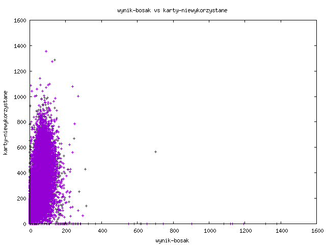
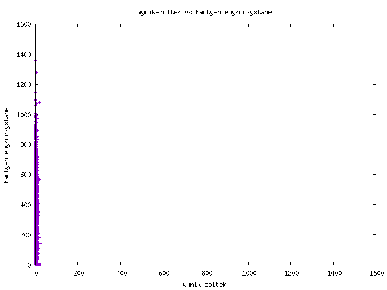
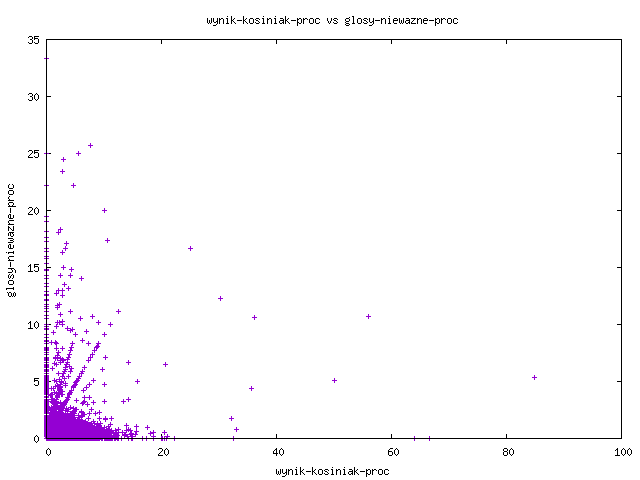
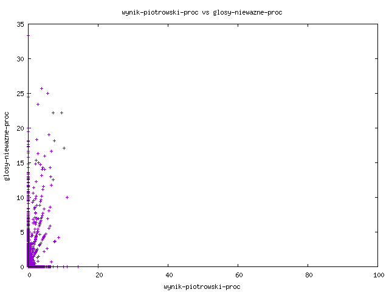
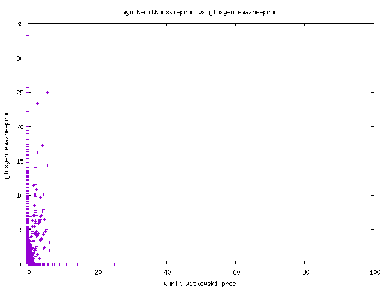

## Candidate result as a function of unused ballot papers
Code used to generate charts:
```
    node scripts_node/generate_chart.js --colY karty_niewykorzystane --colX wynik_biedron 
    node scripts_node/generate_chart.js --colY karty_niewykorzystane --colX wynik_bosak
    node scripts_node/generate_chart.js --colY karty_niewykorzystane --colX wynik_duda
    node scripts_node/generate_chart.js --colY karty_niewykorzystane --colX wynik_holownia
    node scripts_node/generate_chart.js --colY karty_niewykorzystane --colX wynik_jakubiak
    node scripts_node/generate_chart.js --colY karty_niewykorzystane --colX wynik_kosiniak
    node scripts_node/generate_chart.js --colY karty_niewykorzystane --colX wynik_piotrowski
    node scripts_node/generate_chart.js --colY karty_niewykorzystane --colX wynik_tanajno
    node scripts_node/generate_chart.js --colY karty_niewykorzystane --colX wynik_trzaskowski
    node scripts_node/generate_chart.js --colY karty_niewykorzystane --colX wynik_witkowski
    node scripts_node/generate_chart.js --colY karty_niewykorzystane --colX wynik_zoltek
```
Results:







---
Why Duda's and Kosiniak's chart is significantly different than Trzaskowski's and all other candidates? I don't know.


## Candidate result as a function of invalid votes

Code used to generate charts:
```
node scripts_node/generate_chart.js --colY glosy_niewazne_proc --colX wynik_biedron_proc 
node scripts_node/generate_chart.js --colY glosy_niewazne_proc --colX wynik_bosak_proc
node scripts_node/generate_chart.js --colY glosy_niewazne_proc --colX wynik_duda_proc
node scripts_node/generate_chart.js --colY glosy_niewazne_proc --colX wynik_holownia_proc
node scripts_node/generate_chart.js --colY glosy_niewazne_proc --colX wynik_jakubiak_proc
node scripts_node/generate_chart.js --colY glosy_niewazne_proc --colX wynik_kosiniak_proc
node scripts_node/generate_chart.js --colY glosy_niewazne_proc --colX wynik_piotrowski_proc
node scripts_node/generate_chart.js --colY glosy_niewazne_proc --colX wynik_tanajno_proc
node scripts_node/generate_chart.js --colY glosy_niewazne_proc --colX wynik_trzaskowski_proc
node scripts_node/generate_chart.js --colY glosy_niewazne_proc --colX wynik_witkowski_proc
node scripts_node/generate_chart.js --colY glosy_niewazne_proc --colX wynik_zoltek_proc
```

Results:









---
Why Duda's chart is significantly different than Trzaskowski's and all other candidates? I don't know.
Is seems that when Duda had high result in some district electoral commission, it was somehow correlated with high ratio of invalid votes.


